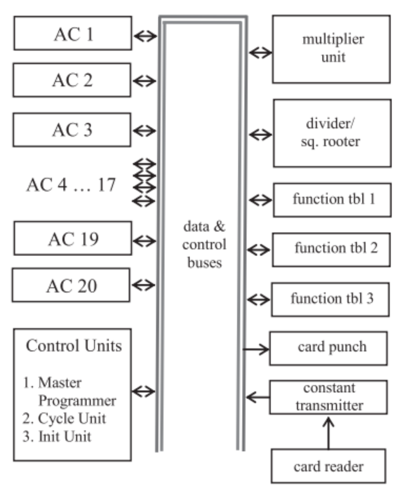

# 2. System Overview

## 2.1 General Description

O ENIAC, ou Eletronic Numerical Integrator and Computer, foi o primeiro computador eletrônico de uso geral. Ele era um aparato gigantesco, e igualmente pesado. Em decorrência disso, seu consumo de energia também era exageradamente elevado. Diferente dos computadores modernos, ele era altamente modular e decentralizado, composto de 40 painéis distintos que podiam operar em paralelo, ligados entre si por uma grande quantidade de cabos também modulares.

  

## 2.2 Dimensions and Layout

O computador como um todo pesava 30 toneladas e ocupava um total de 180 metros quadrados, unindo em sua arquitetura um total de 17.468 válvulas eletrônicas, 70.000 resistores e 10.000 capacitores. O Eniac tinha um formato em U cobrindo três paredes completas de uma sala de aproximadamente 15 X 9 metros. Ele era subdividido em 40 painéis ao longo de sua extensão, sendo que cada paínel tinha 60 centimetros de largura e profundidade, e 2,4 metros de altura. 

   

Tanto os capacitores como os resistores eram alocados próximos as valvúlas termionicas. Os capacitores sendo usados para suprimir oscilações de alta frequência. Já os resistores eram colocados em série com a grade das válvulas, também impedindo oscilações, estas causadas por pequenas diferenças de fiação entre os chassis de plug-in.

## 2.3 Vacuum Tubes

Os tubos termiônicos podiam ser utilizados de duas formas distintas: 
Como um interruptor, onpulsosde seu estado era designado em relação ao potencial da grade presente entre o cátodo e a placa. 
Quando em potencial negativo em relação ao cátodo (estado de corte), a corrente é completamente bloqueada pela ação de repulsão dos eltróns presentes. Assim mantendo uma tensão alta nos tubos, mas sem nenhuma corrente fluindo. 
Inversamente, quando a grade era elevada a um estado positivo (ou só menos negativo) em relação ao cátodo(estado de saturação), a corrente e os eletróns voltavam a fluir livremente. Essa queda de tensão entre a placa e o cátodo ficava tão pequena que poderia ser considerada como um curto circuíto.

O segundo uso dos tubos era o estado de amplificador. Quando operado na região linear (entre corte e saturação), uma pequena variação na tensão da grade causa uma grande variação na corrente de placa. Esse efeito era usado para reforçar pulsos que se dissipavam após longas viagens pelos cabos de dezenas de metros. Também era usado para reforçar sinais mais fracos que podiam se perder ao longo dos circuitos. Para essas ações, existia o padronizador de pulso. Um circuito responsavel por "reformar" os pulsos entre cada uma das unidades dos 40 painéis presentes no Eniac.

Os tubos mais comuns e utilizados no Eniac eram os 6SN7, um tubo formado por um Duplo tríodo que era utilizado como padronizador de pulso e principalmente como contador em anel.
Já os 6V6 eram tubos usados como Drivers, que amplificavam o sinal para qie os contadores fossem acionados. E por serem um tétrodo de feixe, sua arquitetura de duas grades o permitia ser usado como "gate AND" para a programação do sistema. Esses em conjunto dos tubos 6L6formavam quase todo o sistemma de contagem da máquina, visto que, os pêntodos de potência (6L6) eram inversores de potência, e acionavam os cátodos dos contadores decimais. Cada um acionava um sinal de limpeza nos contadores decimais, permitindo assim a adição e subtração de números maiores com o uso de multiplos anies decimais em sequência se complementando.
E por último mas não menos importantes haviam os tubos 5T4, que eram simples díodos de dois eltretodos, servindo como retificadores e protegendo circuitos auxiliares.

## 2.4 Additional Hardware Components
As válvulas termiônicas eram os principais componentes ativos dos circuitos eletrônicos do ENIAC, mas elas não funcionavam isoladamente. Ao redor delas existia uma grande quantidade de componentes responsáveis por estabelecer as condições elétricas dos circuitos, controlar sinais, armazenar pequenas quantidades de carga, configurar determinadas funções e distribuir energia. Entre esses componentes estavam resistores, capacitores, relés, interruptores, transformadores, fusíveis e diferentes tipos de conexões e suportes.

Essa composição ajuda a entender uma característica importante do ENIAC: embora sua computação dependesse diretamente das válvulas, o comportamento de uma unidade era determinado pelo conjunto do circuito, e não por uma única peça. Um acumulador, por exemplo, era formado por diferentes chassis e circuitos nos quais válvulas, resistores, capacitores, transformadores, interruptores e conexões trabalhavam em conjunto. Os desenhos preservados do ENIAC mostram inclusive chassis específicos para décadas do acumulador, controle de programa, repeaters, switch panels e suportes para resistores.

Os resistores eram utilizados para controlar a relação entre tensão e corrente nos circuitos. Em termos simples, um resistor dificulta a passagem da corrente elétrica; quanto maior sua resistência, menor tende a ser a corrente para uma determinada tensão. No ENIAC, isso permitia estabelecer condições específicas de funcionamento para as válvulas, limitar correntes e construir redes capazes de produzir diferentes comportamentos elétricos.

Os resistores também podiam fazer parte da própria representação de informações. Um exemplo particularmente interessante eram as Function Tables. Essas unidades utilizavam redes de resistores para representar funções numéricas: uma configuração podia associar uma determinada entrada a um conjunto de resistências que produzia a saída correspondente. O relatório técnico descreve a Function Table justamente como uma combinação de uma rede de resistores e dos circuitos eletrônicos responsáveis por selecionar e transmitir os valores correspondentes.

Isso significa que, no ENIAC, um resistor não era simplesmente um componente utilizado para "regular energia". Ele podia participar diretamente da maneira como uma informação numérica era representada e processada pelo hardware.

Os capacitores, por sua vez, possuem a capacidade de armazenar carga elétrica temporariamente. Essa propriedade permitia utilizá-los para controlar variações de tensão e auxiliar na estabilização dos circuitos. Em uma máquina que trabalhava continuamente com pulsos elétricos, essa função era particularmente importante, pois alterações rápidas nos níveis elétricos poderiam interferir no comportamento das válvulas e dos circuitos de controle.

A documentação técnica do ENIAC registra diversos circuitos de by-pass condenser, ou capacitores de derivação, associados às diferentes unidades. Esses componentes ajudavam a reduzir variações elétricas locais e a manter uma alimentação mais estável para os circuitos. A coleção de desenhos inclui, por exemplo, esquemas de by-passing condenser wiring para acumuladores, Function Tables, Master Programmer e Constant Transmitter.

Os relés funcionavam de maneira diferente. Em vez de realizar seu trabalho exclusivamente por meio de componentes eletrônicos, eles utilizavam um mecanismo eletromecânico. Uma corrente aplicada a uma bobina produzia um campo magnético que movimentava contatos físicos, permitindo abrir ou fechar outro circuito.

No ENIAC, os relés eram utilizados principalmente em funções de controle e em determinados equipamentos de entrada e saída. Existem, por exemplo, desenhos específicos para a fiação dos relés do Constant Transmitter, além de uma especificação própria para os relés Western Electric utilizados na máquina. Também existiam relés associados ao controle da própria alimentação elétrica do computador.

Os interruptores manuais tinham uma função ainda mais visível para os operadores. Diferentemente de um computador moderno, no qual grande parte da configuração de um programa é armazenada eletronicamente ou em memória, muitas características do ENIAC precisavam ser definidas fisicamente. Interruptores e seletores permitiam configurar parâmetros e comportamentos específicos das unidades.

Nos acumuladores, por exemplo, existiam controles como Function Switch, Repeat Switch, Significant Figures Switch e Round-Off Switch. Esses controles não eram simplesmente comandos de ligar e desligar: sua posição fazia parte da configuração que determinava como a unidade deveria trabalhar.

Essa característica se relaciona diretamente ao modo de programação do ENIAC. Para executar um problema diferente, não bastava fornecer novos dados: era necessário modificar a configuração física de determinadas partes da máquina, utilizando interruptores, seletores e, principalmente, conexões por cabos. Dessa maneira, os componentes auxiliares não eram apenas elementos de suporte. Eles participavam da própria configuração da arquitetura.

## 2.5 Power Supply and Consumption
A quantidade de energia necessária para manter o ENIAC funcionando era uma consequência direta de sua tecnologia. A máquina utilizava milhares de válvulas termiônicas, e cada uma delas precisava permanecer em condições adequadas de operação. Além disso, a instalação possuía ventiladores, fontes de alimentação e equipamentos auxiliares que também consumiam energia.

O sistema elétrico do ENIAC era, portanto, uma infraestrutura própria, formada por fontes, transformadores, barramentos, fusíveis, interruptores e cabos de distribuição. A alimentação não era simplesmente conectada a cada circuito individualmente: ela era distribuída pela estrutura física da máquina por meio de sistemas próprios de alimentação. Os desenhos da instalação incluem uma A.C. Power Distribution Rack, diagramas de controle da alimentação, blocos de fusíveis, barramentos e diferentes elementos das fontes DC.

Uma característica importante era a utilização de diferentes níveis de tensão para diferentes funções. A alimentação de corrente alternada disponível em 220 V era transformada para 110 V para alimentar os circuitos dos filamentos das válvulas. A tensão de 220 V também era utilizada diretamente pelos ventiladores e pelo sistema de alimentação DC. A distribuição dessa energia ocorria por meio de barramentos e cabos instalados na parte inferior dos racks.

Essa separação era necessária porque a energia utilizada pelos filamentos tinha uma função diferente da energia utilizada pelos circuitos eletrônicos. O filamento precisava ser aquecido para que a válvula pudesse funcionar, enquanto os demais circuitos necessitavam de tensões apropriadas para controlar e transmitir os sinais elétricos.

O consumo total do ENIAC chegava a aproximadamente 150 kW. Esse valor é particularmente significativo quando considerado em conjunto com o sistema de refrigeração: grande parte da energia utilizada pelos componentes acabava sendo convertida em calor.

Assim, o consumo elétrico não representava apenas uma dificuldade de infraestrutura. Ele tinha consequências diretas sobre a construção física do computador. Quanto mais energia era consumida pelas válvulas, maior era a quantidade de calor que precisava ser retirada da máquina.

Por isso, a alimentação elétrica e a ventilação devem ser entendidas como dois sistemas diretamente relacionados: a energia permitia que os circuitos funcionassem, enquanto o sistema de ventilação removia parte das consequências térmicas desse funcionamento.

## 2.6 Cooling System
O grande número de válvulas do ENIAC fazia com que a dissipação de calor fosse um problema fundamental de engenharia. As válvulas precisavam permanecer aquecidas para funcionar, mas o calor produzido pelo conjunto dos componentes não poderia simplesmente permanecer dentro dos painéis.

O sistema de resfriamento foi, portanto, incorporado à própria estrutura física do computador. O ar era conduzido através dos painéis, passando pelos componentes e removendo o calor produzido durante a operação. Depois de aquecido, esse ar era conduzido para um sistema de exaustão.

O sistema utilizava filtros de ar antes da entrada nos painéis. Isso era importante porque o interior dos racks continha uma grande quantidade de componentes eletrônicos e conexões que precisavam permanecer protegidos contra partículas e poeira.

A ventilação não era feita simplesmente colocando alguns ventiladores ao redor da máquina. O projeto incorporava a circulação de ar à estrutura dos racks. O relatório técnico descreve conjuntos de painéis cuja ventilação conduzia o ar para um duto superior, que posteriormente o expulsava para fora da sala. O projeto também especificava limites para o aumento de temperatura do ar dentro dos dutos e indicava uma temperatura de operação desejável inferior a 115 °F, aproximadamente 46 °C.

O relatório estabelece ainda que cada conjunto de quatro painéis possuía seu sistema de exaustão conectado a um duto superior. O projeto procurava limitar a elevação da temperatura do ar dentro desses dutos a 15 °F acima da temperatura ambiente quando os filtros estavam em condições normais, com um aumento ainda menor quando eram novos.

Essa informação mostra que o controle térmico não era uma preocupação secundária. O ENIAC foi projetado considerando a circulação do ar como parte de sua operação normal.

A relação entre temperatura e funcionamento também ajuda a explicar por que a ventilação precisava ser contínua. As válvulas dependiam de condições elétricas relativamente precisas e estavam presentes em milhares de circuitos. O aumento excessivo da temperatura poderia alterar essas condições e prejudicar a operação dos circuitos.

Consequentemente, o sistema de resfriamento deve ser entendido como uma extensão da própria arquitetura eletrônica. Sem alimentação elétrica não havia processamento; sem ventilação adequada, a alimentação elétrica produzia uma quantidade de calor que comprometia o funcionamento da máquina.

## 2.7 Modular Panel Organization
O ENIAC não possuía a aparência de um computador moderno porque sua arquitetura não estava concentrada em uma única estrutura compacta. Seus componentes eram distribuídos por uma grande instalação composta por painéis e unidades especializadas, organizados fisicamente ao redor da sala.

Essa organização modular permitia dividir o funcionamento da máquina entre diferentes unidades. Em vez de existir uma única estrutura responsável por todas as operações, havia unidades especializadas para funções como armazenamento temporário e acumulação, multiplicação, divisão, extração de raiz quadrada, geração de funções, controle e entrada e saída.

Um painel, portanto, não deve ser entendido simplesmente como uma parte da carcaça do computador. Ele correspondia a uma determinada parte funcional da máquina e continha os circuitos, controles e conexões necessários para desempenhar aquela função. Isso significa que a modularidade existia não apenas entre os grandes blocos da máquina, mas também dentro de cada unidade.

Essa separação facilitava a construção e a manutenção do computador. Um sistema eletrônico dessa dimensão precisava ser dividido em partes menores para que seus circuitos pudessem ser construídos, testados e posteriormente reparados. A existência de desenhos específicos para chassis, painéis, circuitos e testes das diferentes unidades mostra justamente esse caráter modular da construção.

A modularidade também tinha uma consequência direta sobre a maneira como o ENIAC era programado. Os módulos não funcionavam como partes completamente independentes. Eles precisavam ser conectados uns aos outros para que os dados e sinais de controle percorressem o caminho necessário durante uma computação.

Por exemplo, um acumulador podia receber um número de outra unidade e posteriormente transmitir seu resultado para uma terceira unidade. O caminho entre essas unidades era estabelecido fisicamente por conexões. Assim, a arquitetura modular e o sistema de interconexão eram duas partes do mesmo projeto: os painéis forneciam as funções de processamento, enquanto as conexões determinavam como essas funções seriam combinadas.

Essa característica diferencia o ENIAC de um computador moderno. Atualmente, uma grande parte da comunicação entre unidades ocorre dentro de estruturas eletrônicas compactas, por meio de barramentos e interconexões integradas. No ENIAC, uma parcela significativa dessa organização era visível fisicamente na própria máquina.

A documentação também preserva diagramas de disposição dos painéis utilizados em configurações específicas da máquina, mostrando como as unidades podiam ser organizadas e interligadas para executar determinados problemas.

A organização modular também estava relacionada ao paralelismo do ENIAC. Como diferentes unidades possuíam funções próprias, determinadas operações podiam ser distribuídas entre elas. O computador não precisava concentrar toda a atividade em uma única unidade central de processamento.

É justamente essa característica que ajuda a compreender por que o ENIAC pode ser descrito como uma máquina altamente distribuída: sua capacidade de computação estava espalhada por diversos módulos, e o comportamento geral surgia da interação entre eles.

Por isso, quando observamos uma fotografia do ENIAC, é importante não interpretar os painéis como simplesmente "partes de uma máquina muito grande". Cada painel representava uma parcela da lógica computacional do sistema. O conjunto desses módulos, suas fontes de alimentação, sistemas de ventilação, controles e interconexões formava o computador completo.

## 2.8 Data Flow

> Descrição da Imagem: Mapa simplificado de todas as 31 unidades funcionais do sistema interconectadas por um canal central, apresentando uma topologia geral e quais unidades trocavam dados entre si (Acumuladores, I/O e Unidades Matemáticas). Essa imagem usa a palavra barramento, que não é o termo mais preciso para o caso do ENIAC (Consulte o 10° tópico no arquivo 03-interconnections).

As informações númericas trafegavam na forma de conjuntos de pulsos elétricos na frequência de 100kHz, gerados pela Unidade Cíclica, operando em base decimal. Para transmitir um valor, a unidade emissora convertia o número armazenado em seus contadores de anel em uma sequeência exata de pulsos elétricos. 
Exemplo: o dígito 7 gerava exatamente 7 pulsos contínuos. 
Esses pulsos viajavam através de cabos alocados nas Bandejas de Dígitos que percorriam a extensão frontal da máquina. Cada cabo de dados possuía 11 vias independentes: 10 vias dedicadas a transportar os dígitos do número (oque permitia tráfedo de valores com no máximo 10 casas decimais de precisão) e 1 via exclusiva para indicar o sinal (que era positivo ou negativo).

A rota exata dos dados era definida manualmente através de cabos conectores. Se o acumulador 1 precisasse enviar um operando para o Multiplicador, um cabo físico precisava estar diretamente plugado da porta de saída de um para a porta de entrada do outro (🫣).

Todo esse tráfego numérico era separado do sistema de controle. Enquanto os números viajavam pelas bandejas de dígitos, os pulsos de ativação/sincronização que diziam às unidade o momento exato de transmitir ou receber dados trafegagavam por uma rede de cabos separada: as bandejas de programa. Ao chegar na unidade de destino os pulsos de dados recebidos acionavam os tubos de vácuo dos contadores de anel locais, que giravam eletronicamente para registrar o novo valor ou realizar a operação 
matemática de forma imediata.

> Descrição da Imagem: Diagrama oficial de uma conexão bidirecional ponto a ponto entre dois Acumuladores através das Bandejas de Dígitos. Destaque ao uso de Amplificadores de Pulso, instalados nas bandejas para regenerar os pulsos elétricos, evitando a degradação do sinal em cabos longos.

## 2.9 Block Diagram

Representação visual da disposição do hardware do ENIAC (suas unidades):

### Lista de componentes no diagrama:

[Parede Equerda]
- Initiating Unit
- Cycling Unit
- Master Programmer Panel 1 (Printer 1)
- Master Programmer Panel 2
- Function Table 1 Panel 1
- Function Table 1 Panel 2
- Accumulator 1
- Accumulator 2 (Quotient)
- Divider & Square Rooter
- Accumulator 3 (Numerator I)
- Accumulator 4 (Numerator II)
- Accumulator 5 (Denominator - Square Root I)
- Accumulator 6 (Denominator - Square Root II)
- Accumulator 7 (Shift I)
- Accumulator 8 (Shift II)
- Accumulator 9 (Multiplier)

[Parede Superior]
- Accumulator 10 (Multiplicand)
- Multiplier 1
- Multiplier 2
- Multiplier 3
- Accumulator 11 (Left Hand Partial Products I)
- Accumulator 12 (Left Hand Partial Products II)
- Accumulator 13 (Right Hand Products I - Printer 2 & 3)
- Accumulator 14 (Right Hand Products II - Printer 4 & 5)

[Parede Direita]
- Accumulator 15 (Printer 6)
- Accumulator 16 (Printer 7 & 8)
- Accumulator 17 (Printer 9 & 10)
- Accumulator 18 (Printer 11 & 12)
- Function Table 2 Panel 1
- Function Table 2 Panel 2
- Function Table 3 Panel 1
- Function Table 3 Panel 2
- Accumulator 19 (Printer 13 & 14)
- Accumulator 20 (Printer 15 & 16)
- Constant Transmitter Panel 1
- Constant Transmitter Panel 2
- Constant Transmitter Panel 3
- Printer Panel 1
- Printer Panel 2
- Printer Panel 3

[Por aí]
- Portable Function Table A (Próximo à parede esquerda)
- Portable Function Table B (Próximo à parede direita)
- Portable Function Table C (Próximo à parede direita)
- IBM Card Reader (conectado ao Constant Transmitter Panel 3)
- IBM Card Punch (Summary Punch) (conectado ao Printer Panel 2)

## 2.10 Main Characteristics

Table

| Feature | Description |
|---------|-------------|
|Arquitetura Base|Descentralizada, com operação em paralelo e sem memória unificada.|
|Sistema Numérico|Decimal (base 10), utilizando contadores de anel em vez de lógica binária.|
|Tamanho da Palavra|10 dígitos decimais mais 1 dígito de sinal (positivo/negativo).|
|Clock|100 kHz, operado via trens de pulsos elétricos gerados pela Unidade Cíclica.|
|Componentes|~17.468 válvulas termiônicas, 70.000 resistores e 10.000 capacitores.|
|Layout|Ocupava 180 m² em formato de "U" (dividido em 40 painéis modulares), pesando ~30 toneladas.|
|Consumo Elétrico|150 kW, exigindo infraestrutura robusta e linhas de energia dedicadas|
|Sistema de Resfriamento|Ventilação forçada com motores e exaustores embutidos nos painéis para dissipar o calor extremo das válvulas.|
|Comunicação|Transmissão ponto a ponto via cabos físicos nas Bandejas de Dígitos.|
|Programação|Configuração em nível de hardware, usando cabos nas Bandejas de Programa e chaves rotativas manuais|
|Armazenamento|20 Acumuladores (leitura/escrita de dados temporários) e 3 Tabelas de Função (somente leitura de constantes)|
