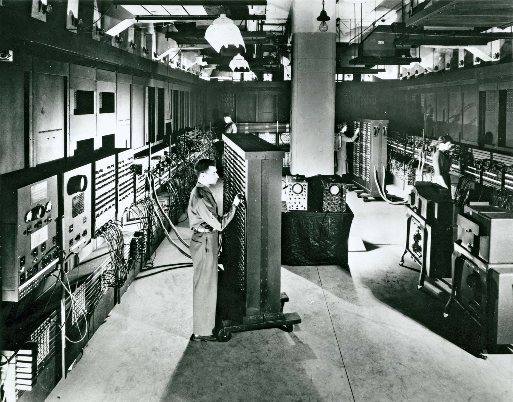
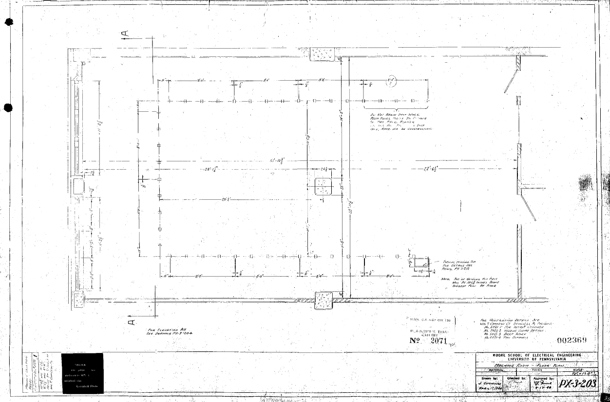
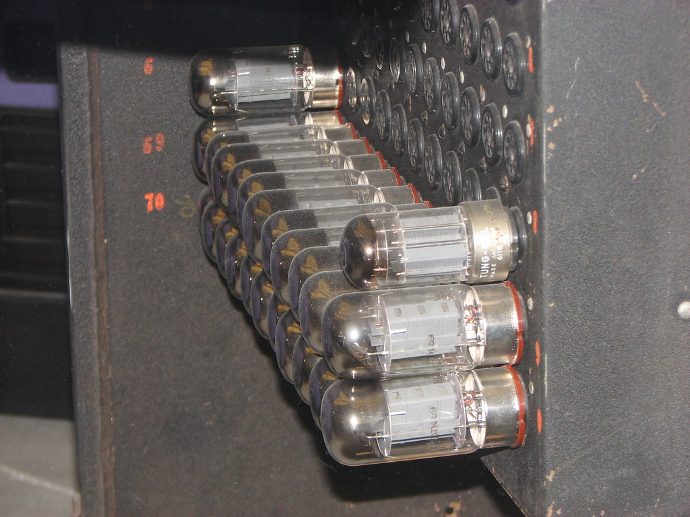
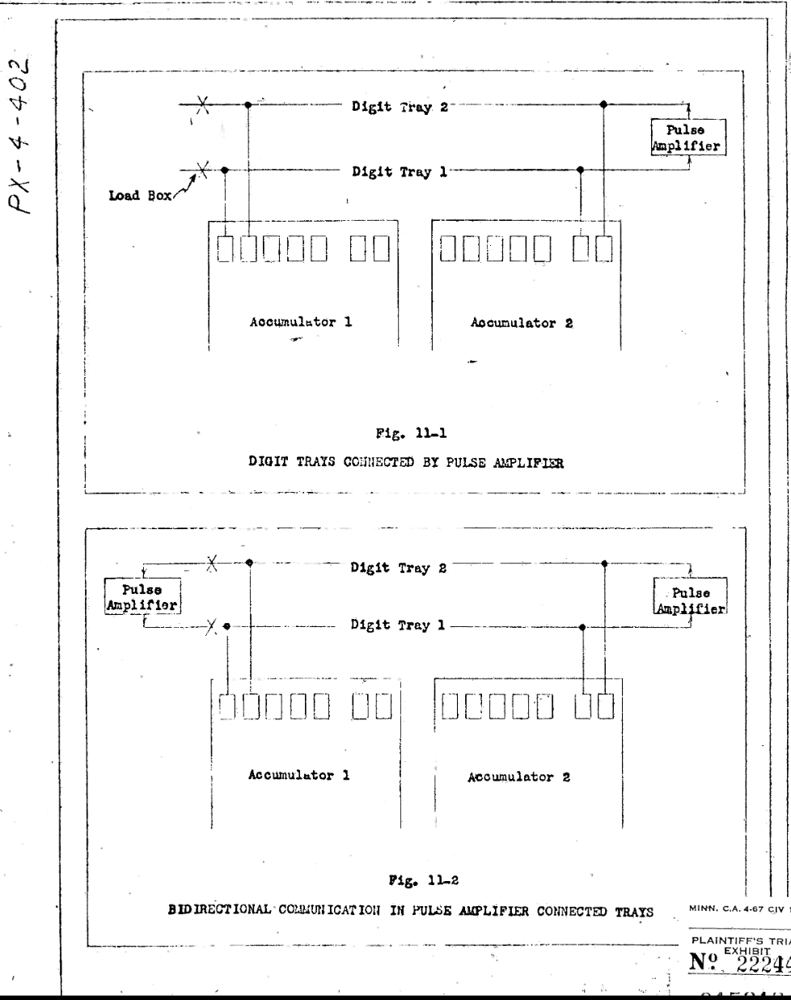
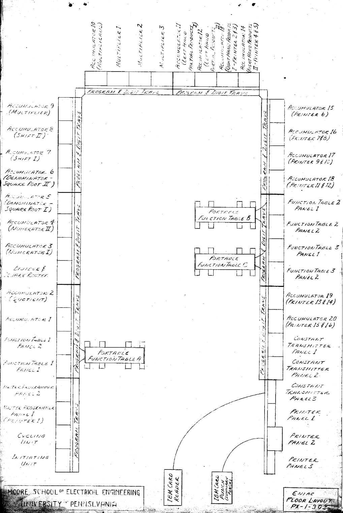

# 2. System Overview

## 2.1 General Description

O ENIAC, ou Eletronic Numerical Integrator and Computer, foi o primeiro computador eletrõnico de uso geral. Ele era um aparato gigantesco, e igualmente pesado. Em decorrência disso, seu consumo de energia também era exageradamente elevado. Diferente dos computadores modernos, ele era altamente modular e decentralizado, composto de 40 painéis distintos que podiam operar em paralelo, ligados entre si por uma grande quantidade de cabos também modulares.

  

## 2.2 Dimensions and Layout

O computador como um todo pesava 30 toneladas e ocupava um total de 180 metros quadrados, unindo em sua arquitetura um total de 17.468 válvulas eletrônicas, 70.000 resistores e 10.000 capacitores. O Eniac tinha um formato em U cobrindo três paredes completas de uma sala de aproximadamente 15 X 9 metros. Ele era subdividido em 40 painéis ao longo de sua extensão, sendo que cada paínel tinha 60 centimetros de largura e profundidade, e 2,4 metros de altura. 

   

Tanto os capacitores como os resistores eram alocados próximos as valvúlas termionicas. Os capacitores sendo usados para suprimir oscilações de alta frequência. Já os resistores eram colocados em série com a grade das válvulas, também impedindo oscilações, estas causadas por pequenas diferenças de fiação entre os chassis de plug-in.

## 2.3 Vacuum Tubes

Os tubos termiônicos podiam ser utilizados de duas formas distintas: 
Como um interruptor, onpulsosde seu estado era designado em relação ao potencial da grade presente entre o cátodo e a placa. 
Quando em potencial negativo em relação ao cátodo (estado de corte), a corrente é completamente bloqueada pela ação de repulsão dos eltróns presentes. Assim mantendo uma tensão alta nos tubos, mas sem nenhuma corrente fluindo. 
Inversamente, quando a grade era elevada a um estado positivo (ou só menos negativo) em relação ao cátodo(estado de saturação), a corrente e os eletròns voltavam a fluir livremente. Essa queda de tensão entre a placa e o cátodo ficava tão pequena que poderia ser considerada como um curto circuíto.

O segundo uso dos tubos era o estado de amplificador. Quando operado na região linear (entre corte e saturação), uma pequena variação na tensão da grade causa uma grande variação na corrente de placa. Esse efeito era usado para reforçar pulsos que se dissipavam após longas viagens pelos cabos de dezenas de metros. Também era usado para reforçar sinais mais fracos que podiam se perder ao longo dos circuitos. Para essas ações, existia o padronizador de pulso. Um circuito responsavel por "reformar" os pulsos entre cada uma das unidades dos 40 painéis presentes no Eniac.

Os tubos mais comuns e utilizados no Eniac eram os 6SN7, um tubo formado por um Duplo tríodo que era utilizado como padronizador de pulso e principalmente como contador em anel.
Já os 6V6 eram tubos usados como Drivers, que amplificavam o sinal para qie os contadores fossem acionados. E por serem um tétrodo de feixe, sua arquitetura de duas grades o permitia ser usado como "gate AND" para a programação do sistema. Esses em conjunto dos tubos 6L6formavam quase todo o sistemma de contagem da máquina, visto que, os pêntodos de potência (6L6) eram inversores de potência, e acionavam os cátodos dos contadores decimais. Cada um acionava um sinal de limpeza nos contadores decimais, permitindo assim a adição e subtração de números maiores com o uso de multiplos anies decimais em sequência se complementando.
E por último mas não menos importantes haviam os tubos 5T4, que eram simples díodos de dois eltretodos, servindo como retificadores e protegendo circuitos auxiliares.

## 2.4 Additional Hardware Components
- O papel de resistores, capacitores, relés e interruptores manuais

## 2.5 Power Supply and Consumption
- Requisitos de consumo elétrico e as linhas de energia dedicadas

## 2.6 Cooling System
- Como o sistema dissipava a quantidade enorme de calor gerada pelos tubos

## 2.7 Modular Panel Organization
- Divisão da máquina em 40 painéis distintos

## 2.8 Data Flow

> Descrição da Imagem: Mapa simplificado de todas as 31 unidades funcionais do sistema interconectadas por um canal central, apresentando uma topologia geral e quais unidades trocavam dados entre si (Acumuladores, I/O e Unidades Matemáticas). Essa imagem usa a palavra barramento, que não é o termo mais preciso para o caso do ENIAC (Consulte o 10° tópico no arquivo 03-interconnections).

As informações númericas trafegavam na forma de conjuntos de pulsos elétricos na frequência de 100kHz, gerados pela Unidade Cíclica, operando em base decimal. Para transmitir um valor, a unidade emissora convertia o número armazenado em seus contadores de anel em uma sequeência exata de pulsos elétricos. 
Exemplo: o dígito 7 gerava exatamente 7 pulsos contínuos. 
Esses pulsos viajavam através de cabos alocados nas Bandejas de Dígitos que percorriam a extensão frontal da máquina. Cada cabo de dados possuía 11 vias independentes: 10 vias dedicadas a transportar os dígitos do número (oque permitia tráfedo de valores com no máximo 10 casas decimais de precisão) e 1 via exclusiva para indicar o sinal (que era positivo ou negativo).

A rota exata dos dados era definida manualmente através de cabos conectores. Se o acumulador 1 precisasse enviar um operando para o Multiplicador, um cabo físico precisava estar diretamente plugado da porta de saída de um para a porta de entrada do outro (🫣).

Todo esse tráfego numérico era separado do sistema de controle. Enquanto os números viajavam pelas bandejas de dígitos, os pulsos de ativação/sincronização que diziam às unidade o momento exato de transmitir ou receber dados trafegagavam por uma rede de cabos separada: as bandejas de programa. Ao chegar na unidade de destino os pulsos de dados recebidos acionavam os tubos de vácuo dos contadores de anel locais, que giravam eletronicamente para registrar o novo valor ou realizar a operação 
matemática de forma imediata.

> Descrição da Imagem: Diagrama oficial de uma conexão bidirecional ponto a ponto entre dois Acumuladores através das Bandejas de Dígitos. Destaque ao uso de Amplificadores de Pulso, instalados nas bandejas para regenerar os pulsos elétricos, evitando a degradação do sinal em cabos longos.

## 2.9 Block Diagram

Representação visual da disposição do hardware do ENIAC (suas unidades):

### Lista de componentes no diagrama:

[Parede Equerda]
- Initiating Unit
- Cycling Unit
- Master Programmer Panel 1 (Printer 1)
- Master Programmer Panel 2
- Function Table 1 Panel 1
- Function Table 1 Panel 2
- Accumulator 1
- Accumulator 2 (Quotient)
- Divider & Square Rooter
- Accumulator 3 (Numerator I)
- Accumulator 4 (Numerator II)
- Accumulator 5 (Denominator - Square Root I)
- Accumulator 6 (Denominator - Square Root II)
- Accumulator 7 (Shift I)
- Accumulator 8 (Shift II)
- Accumulator 9 (Multiplier)

[Parede Superior]
- Accumulator 10 (Multiplicand)
- Multiplier 1
- Multiplier 2
- Multiplier 3
- Accumulator 11 (Left Hand Partial Products I)
- Accumulator 12 (Left Hand Partial Products II)
- Accumulator 13 (Right Hand Products I - Printer 2 & 3)
- Accumulator 14 (Right Hand Products II - Printer 4 & 5)

[Parede Direita]
- Accumulator 15 (Printer 6)
- Accumulator 16 (Printer 7 & 8)
- Accumulator 17 (Printer 9 & 10)
- Accumulator 18 (Printer 11 & 12)
- Function Table 2 Panel 1
- Function Table 2 Panel 2
- Function Table 3 Panel 1
- Function Table 3 Panel 2
- Accumulator 19 (Printer 13 & 14)
- Accumulator 20 (Printer 15 & 16)
- Constant Transmitter Panel 1
- Constant Transmitter Panel 2
- Constant Transmitter Panel 3
- Printer Panel 1
- Printer Panel 2
- Printer Panel 3

[Por aí]
- Portable Function Table A (Próximo à parede esquerda)
- Portable Function Table B (Próximo à parede direita)
- Portable Function Table C (Próximo à parede direita)
- IBM Card Reader (conectado ao Constant Transmitter Panel 3)
- IBM Card Punch (Summary Punch) (conectado ao Printer Panel 2)

## 2.10 Main Characteristics

Table

| Feature | Description |
|---------|-------------|
|Arquitetura Base|Descentralizada, com operação em paralelo e sem memória unificada.|
|Sistema Numérico|Decimal (base 10), utilizando contadores de anel em vez de lógica binária.|
|Tamanho da Palavra|10 dígitos decimais mais 1 dígito de sinal (positivo/negativo).|
|Clock|100 kHz, operado via trens de pulsos elétricos gerados pela Unidade Cíclica.|
|Componentes|~17.468 válvulas termiônicas, 70.000 resistores e 10.000 capacitores.|
|Layout|Ocupava 180 m² em formato de "U" (dividido em 40 painéis modulares), pesando ~30 toneladas.|
|Consumo Elétrico|150 kW, exigindo infraestrutura robusta e linhas de energia dedicadas|
|Sistema de Resfriamento|Ventilação forçada com motores e exaustores embutidos nos painéis para dissipar o calor extremo das válvulas.|
|Comunicação|Transmissão ponto a ponto via cabos físicos nas Bandejas de Dígitos.|
|Programação|Configuração em nível de hardware, usando cabos nas Bandejas de Programa e chaves rotativas manuais|
|Armazenamento|20 Acumuladores (leitura/escrita de dados temporários) e 3 Tabelas de Função (somente leitura de constantes)|
