# 3. Interconnections

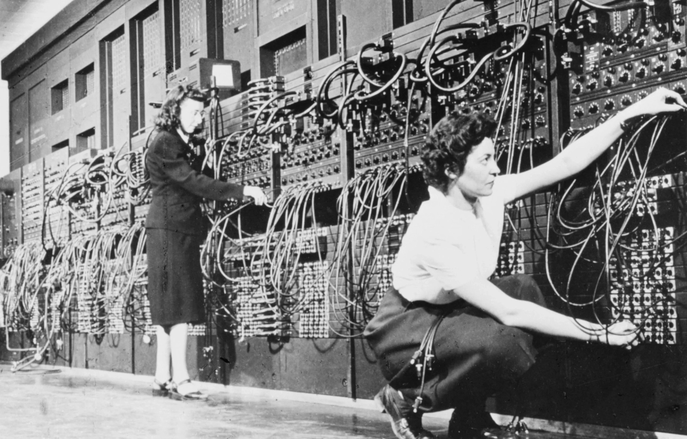  

## 3.1 Cabling Overview

A interconexão dos 40 painéis modulares do ENIAC era realizada por um sistema de cabeamento estritamente segmentado e roteado de acordo com a função elétrica. A estrutura de comunicação e alimentação da máquina era dividida em três formas principais de cabeamento:

### 3.1.1. Backplate Cabling
Calhas de energia pesadas e barramentos de cobre maciço ficavam ocultos na parte traseira da máquina. Essa infraestrutura distribuía as linhas de corrente contínua (DC) para polarizar as placas e grades dos tubos, além de imensas correntes alternadas (AC) dedicadas exclusivamente aos circuitos de aquecimento dos filamentos das válvulas. Como o ENIAC consumia cerca de 150 quilowatts de energia (suficiente para iluminar uma pequena cidade da época), essa fiação traseira era superdimensionada e estritamente separada. Nenhum dado numérico ou pulso elétrico trafegava por essa área para evitar que o intenso campo eletromagnético da alimentação causasse interferência no processamento.

### 3.1.2. Internal Cabling
Dentro de cada um dos 40 painéis, as conexões entre os tubos de vácuo, resistores, capacitores e relés eram fixas e soldadas ponto a ponto diretamente nos chassis. Essa fiação interna resolvia a lógica local da unidade, formando os caminhos fixos por onde o processamento era de fato executado. Uma característica notável desse design era a modularidade, os chassis internos funcionavam como gavetas removíveis. Se uma válvula queimasse ou um fio interno partisse, os engenheiros não precisavam dessoldar o painel inteiro, bastava desencaixar o módulo defeituoso da estrutura e plugar um chassi de reposição idêntico, minimizando o tempo de inatividade da máquina.

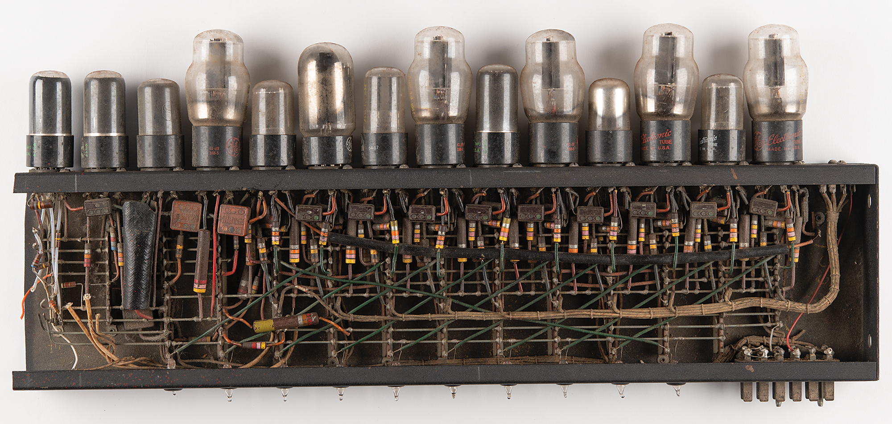

> Descrição da Imagem: Vista inferior de um chassi modular plugável do ENIAC, evidenciando o cabeamento interno e a fiação ponto a ponto soldada manualmente. Destaque para a malha de barramentos de cobre, resistores, capacitores e o conector elétrico multipinos na extremidade inferior direita, utilizado para encaixar o módulo na estrutura fixa do painel.

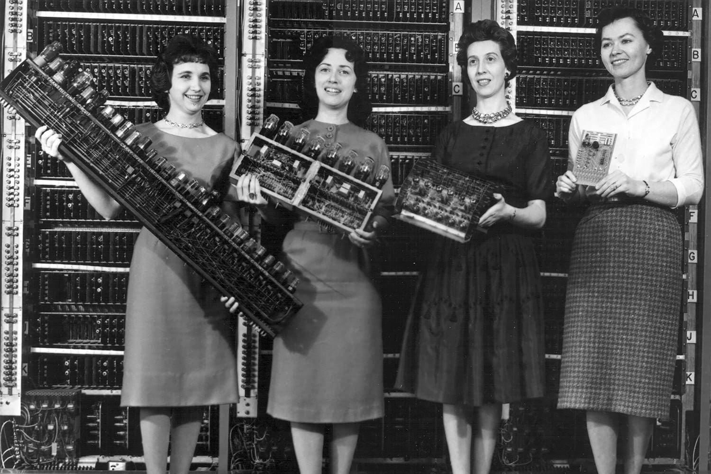

> Descrição da Imagem: Demonstração da escala física dos componentes internos do ENIAC e sua evolução. À esquerda, uma operadora segura uma unidade decádica modular completa retirada de um dos painéis, revelando a densidade e o tamanho dos chassis de válvulas que compunham os circuitos internos da máquina.

### 3.1.3 Frontal Cabling
Comunicação global entre unidades distintas ocorria exclusivamente na parte exterior da máquina. Para suportar o peso e organizar a enorme quantidade de fios necessários para interligar os painéis que podiam estar a vários metros de distância, o ENIAC utilizava um sistema de calhas metálicas horizontais chamadas de bandejas.
Essas bandejas percorriam toda a extensão das paredes da sala, fixadas na estrutura dos painéis. As bandejas inferiores e intermediárias acomodavam os cabos longos, enquanto as conexões diretas eram feitas plugando as extremidades desses cabos nos soquetes expostos nos painéis frontais e painéis de interruptores de cada unidade. A topologia da rede era definida pela disposição desses cabos frontais, cabos esses que permitiam à máquina operar de forma altamente paralela, conectando conjuntos de unidades que poderiam operar simultaneamente.

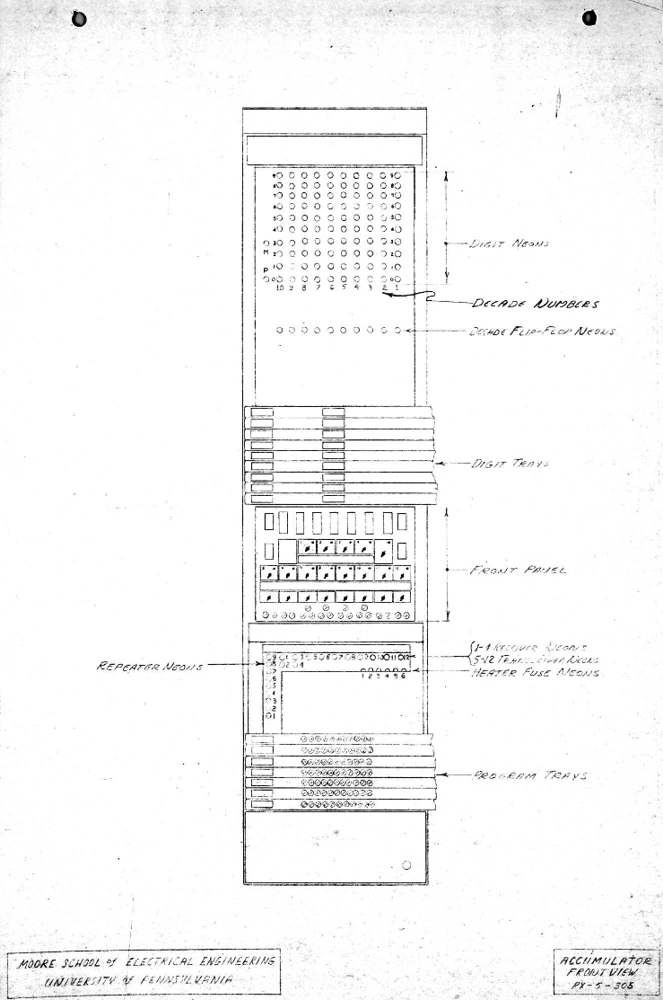  

> Descrição da Imagem: Desenho técnico da face frontal de um Acumulador evidenciando a infraestrutura de cabeamento da unidade. Destaque para a passagem horizontal das Digit Trays na região intermediária (calhas que acomodavam os cabos de 11 vias para tráfego numérico) e das Program Trays na base do painel (calhas para os cabos de pulsos de sincronismo e controle), demonstrando os pontos físicos exatos onde os cabos flexíveis eram plugados para conectar a unidade ao restante da máquina.

O sistema de cabos frontais no ENIAC foi fortemente inspirado nas centrais telefônicas da época. Como as operadoras já tinham familiaridade (ou podiam aprender facilmente) com essa interface, a equipe projetou os painéis de forma análoga a ela, definindo o roteamento de fluxo de dados fisicamente ligando uma unidade para "conversar" com outra.

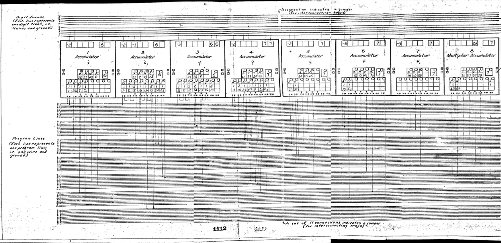

> Descrição da Imagem: Diagrama esquemático de interconexão entre os Acumuladores 1 a 8 e as calhas de cabeamento durante um cálculo balístico. Destaque para a separação física entre as Digit Trunks no topo (cabos de 11 vias para transporte de dados numéricos) e as Program Lines na base (cabos para pulsos de controle), interligadas aos painéis por conexões verticais (patch cords) que definem a rota dos dados e a ordem de disparo das operações.

## 3.2 Signal Types

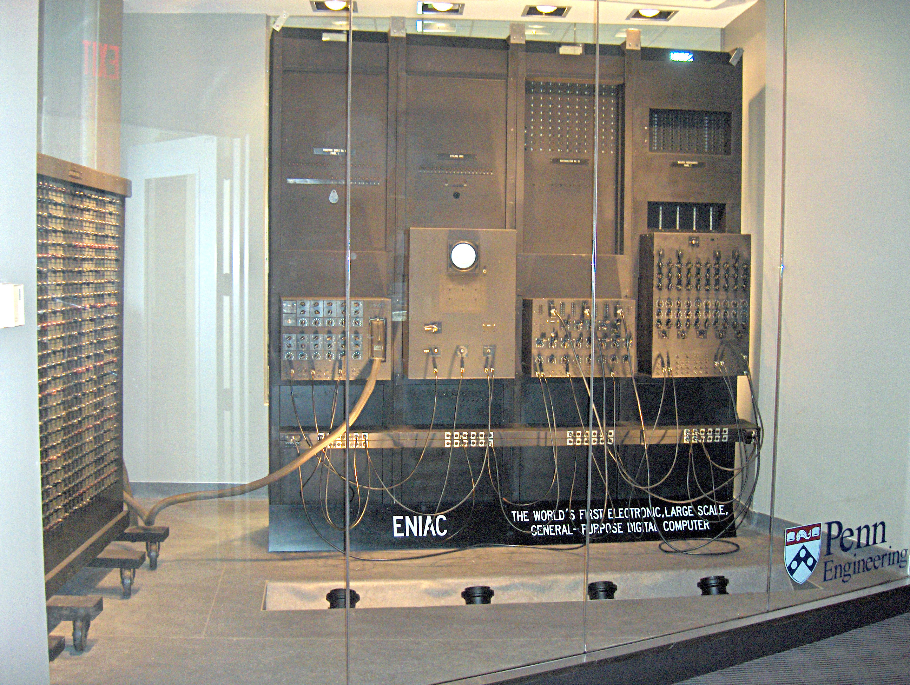

> Descrição da Imagem: Painéis originais do ENIAC em exibição na Universidade da Pensilvânia. O segundo painel vertical a partir da esquerda é a Unidade Cíclica (identificável pela tela circular do osciloscópio central, usada no monitoramento do clock de 100 kHz), ladeada por uma Tabela de Função portátil à esquerda, um Acumulador e o Programador Mestre à direita, todos interligados por cabos nas calhas inferiores.

A precisão absoluta desse ciclo de 200 microssegundos (conhecido como Ciclo de Adição) era garantida por um oscilador mestre de cristal de quartzo operando a uma frequência fixa de 100 kHz dentro da Unidade Cíclica. Esse oscilador gerava um pulso fundamental a cada 10 microssegundos. Ao contar 20 desses pulsos fundamentais, a máquina completava um passo lógico de processamento. Essa base de tempo rígida impedia que as unidades perdessem o sincronismo, mesmo operando em paralelo por horas a fio. (Mais detalhes sobre sincronização do ENIAC no tópico seguinte, 3.3 Synchronization, aqui nesse mesmo arquivo)

Um pulso no ENIAC é uma variação transitória e rápida de potencial elétrico em uma linha condutora. Em repouso, as linhas operavam polarizadas com alta tensão negativa (geralmente -345V de corrente contínua para acoplamento direto com as grades das válvulas). Quando um tubo transmissor entrava em saturação, ele injetava corrente na linha, elevando abruptamente o potencial para -290V por cerca de 2 microsegundos (ou 0,000002 segundos) antes de retornar ao repouso, formando o pulso elementar contínuo de trabalho da máquina.

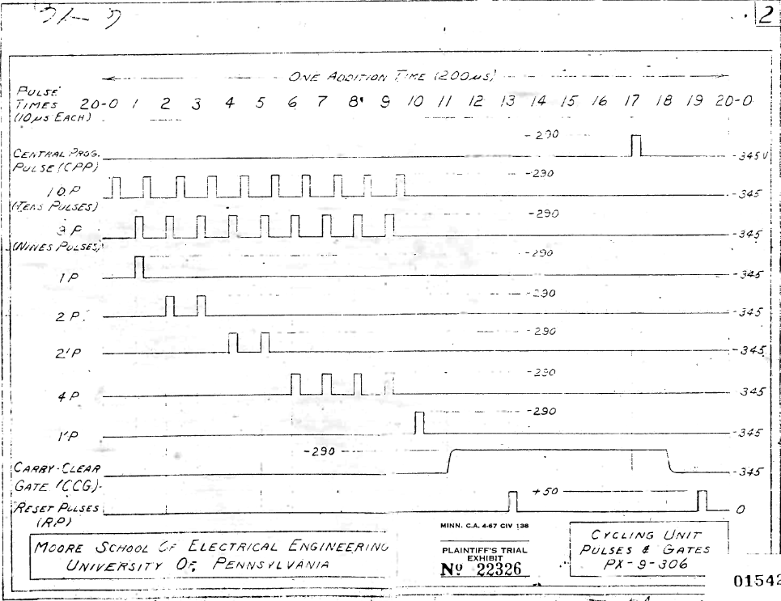

> Descrição da Imagem: Diagrama temporal oficial da Unidade Cíclica, ilustrando as formas de onda, níveis de tensão e janelas de atuação durante um ciclo de adição, que dura 200 microsegundos. Mais detalhes abaixo.

Toda a operação do sistema era regida por quatro categorias de sinais elétricos sincronizados pela Unidade Cíclica e encapsulados em um ciclo de 200 microsegundos (dividido em 20 tempos, cada tempo possuindo 10 microsegundos):

### 3.2.1. Digit Pulses
Os dados trafegavam em base decimal através de trens de pulso emitidos na primeira metade do ciclo (tempos 1/20 a 10/20). A Unidade Cíclica não possuía geradores dedicados para cada um dos números de 1 a 9, em vez disso, ela gerava blocos fundamentais de pulsos com durações e espaçamentos temporais específicos:
- 1P: Emite 1 pulso no tempo 1/20
- 2P: Emite 2 pulsos sequenciais nos tempos 2/20 e 3/20
- 2'P: Emite 2 pulsos sequenciais nos tempos 4/20 e 5/20 (separados do 2P para evitar sobreposição)
- 4P: Emite 4 pulsos nos tempos de 6/20 a 9/20
- 1'P: Emite 1 pulso isolado no tempo 10/20

Qualquer número de 1 a 9 era sintetizado combinando essas linhas através de portas lógicas. Exemplo: o dígito 7 era formado pela soma lógica de 1P + 2P + 4P.

Ao realizar a soma lógica de 1P + 2P + 4P para formar o dígito 7, os pulsos nunca viajavam sobrepostos no mesmo instante, o que causaria um pico de voltagem indesejado. Em vez disso, a Unidade Cíclica distribuía esses trens de pulso cronologicamente ao longo da primeira metade do ciclo. O pulso 1P ocorria no tempo 1; os pulsos 2P chegavam nos tempos 2 e 3; e os pulsos 4P chegavam nos tempos 6, 7, 8 e 9. O contador receptor simplesmente registrava 7 picos elétricos distintos chegando em sequência pela mesma linha condutora, avançando suas válvulas de contagem um passo para cada pico recebido.

As saídas 9P e 10P eram pré-fabricadas com 9 e 10 pulsos contínuos. Elas eram o mecanismo central para contornar a ausência de circuitos dedicados de subtração. O ENIAC realizava subtrações utilizando a aritmética de complemento de dez: para subtrair um valor, a linha de sinal (a 11ª via do Digit Trunk) instruía as portas lógicas a injetarem o trem de 9P em todos os dígitos vazios e o trem 1P (no tempo 10) para arredondar, transformando a subtração em uma adição contínua que transbordava a capacidade do contador, resultando no valor negativo correto.

### 3.2.2. Program Pulses
Os comandos e transições de rotina utilizavam pulsos unitários curtos de 2 microssegundos, idênticos em formato elétrico aos Digit Pulses, mas roteados através de bandejas isoladas e cabos coaxiais. Em vez de representarem quantidades matemáticas, eles atuavam exclusivamente como gatilhos de eventos e controle de estado.

- Central Programming Pulse (CPP): O pulso mestre gerado pontualmente no tempo 17/20 de cada ciclo. Ele era o metrônomo que ditava a transição entre as etapas do programa.
- Lógica de Transmissão e Paralelismo: Quando uma unidade recebia um pulso de programa em seu terminal de entrada, ela ativava um circuito flip-flop interno que acordava a unidade para realizar sua tarefa local no ciclo seguinte. Ao encerrar o cálculo, seu circuito liberava a passagem do CPP daquele ciclo para o borne de saída. Esse detalhe da arquitetura que permitia o paralelismo do ENIAC. Um único pulso de saída podia ser roteado e ramificado através de múltiplos cabos simultaneamente, despolarizando as grades das válvulas de três ou quatro unidades diferentes ao mesmo tempo. Isso permitia que a máquina iniciasse operações matemáticas inteiramente distintas no exato mesmo microssegundo.
- Dummy Programs: Como o fluxo do programa era puramente ditado pela viagem dos cabos de uma unidade a outra, a equipe precisava de métodos para atrasar certas operações enquanto aguardava cálculos mais demorados (como uma divisão). Para isso, roteava-se o Program Pulse para os controles de programa ociosos de um acumulador, configurados para não realizar nenhuma soma matemática e apenas aguardar um número de ciclos anteriormente definidos, e após estes, emitia o pulso de volta na saída, criando um temporizador de atraso lógico.

### 3.2.3. Gate Signals
Diferente dos pulsos curtos de 2 microssegundos, uma Porta (Gate) era uma elevação contínua de tensão mantida estável para habilitar a condução em válvulas pentodo (compostas por múltiplos filamentos de grade). A operação dessas portas baseava-se em um princípio físico de coincidência: o tubo só permitia a passagem de corrente se a sua primeira grade e a sua terceira grade recebessem voltagens positivas simultaneamente. O sinal de Porta era aplicado em uma das grades, liberando a válvula. Apenas enquanto essa Porta estivesse ativa, um pulso numérico de 2 microssegundos batendo na outra grade conseguiria atravessar a válvula. Se a Porta estivesse desligada (em tensão negativa), os pulsos de dados eram fisicamente bloqueados. É dessa forma puramente analógica que o ENIAC executava a lógica AND.

- Carry-Clear Gate: Janela temporal contínua que permanecia ativa entre os tempos 11/20 e 18/20 (70 microsegundos). Esse sinal desobstruía os circuitos de transporte de dezenas, permitindo que os contadores repassassem o "vai-um" gerado pela adição aos estágios seguintes sem colidir com os dados de dígitos (que haviam terminado no tempo 10).

### 3.2.4. Reset Pulses
Embora fizessem parte da regência de sincronismo da Unidade Cíclica, os pulsos de reset não eram janelas contínuas como os Gate Signals, nem carregavam informações numéricas ou acionavam rotinas. Tratavam-se de pulsos agudos de limpeza elétrica, referenciados em 0V (com pico transiente em +50V), disparados exclusivamente em dois momentos críticos para reverter as válvulas biestáveis ao seu estado de repouso.

Seu propósito era restaurar mecanicamente a memória curta dos circuitos. O pulso do tempo 13/20 reiniciava os gatilhos de transporte (carry triggers) logo após o transporte de dezenas ter sido concluído. Já o pulso do tempo 19/20 zerava os estados transitórios de todos os controles de programa da máquina. Esse choque pontual de +50V "limpava o palco" um microssegundo antes do tempo 0, garantindo que nenhum circuito permanecesse ativado por capacitância residual e que a máquina iniciasse o ciclo subsequente com todas as linhas estabilizadas.

> Nota: Capacitância é a propriedade que dois condutores separados por um isolante têm de armazenar carga elétrica sob uma diferença de potencial, retendo energia em um campo elétrico. Por exigir tempo para carregar e descarregar essas cargas, ela se opõe a variações bruscas de voltagem, agindo como um amortecedor elétrico que suaviza e atrasa transições rápidas de sinal. Esse efeito, em cabos e circuitos de alta velocidade, faz com que pulsos de bordas retangulares percam a nitidez e fiquem arredondados.

### Pulse Standardizers
Conforme esses diferentes tipos de sinais viajavam por dezenas de metros de cabos e bandejas, as perdas capacitivas e resistivas deformavam as ondas quadradas e derrubavam os -290V nominais. Para que as válvulas operassem de modo confiável, circuitos padronizadores utilizavam tubos duplos 6SN7 para detectar o limiar da onda degradada e recriar bordas retangulares afiadas, enquanto tubos de potência 6V6 e 6L6 restauravam a amplitude de tensão antes de encaminhar o sinal para a unidade receptora.

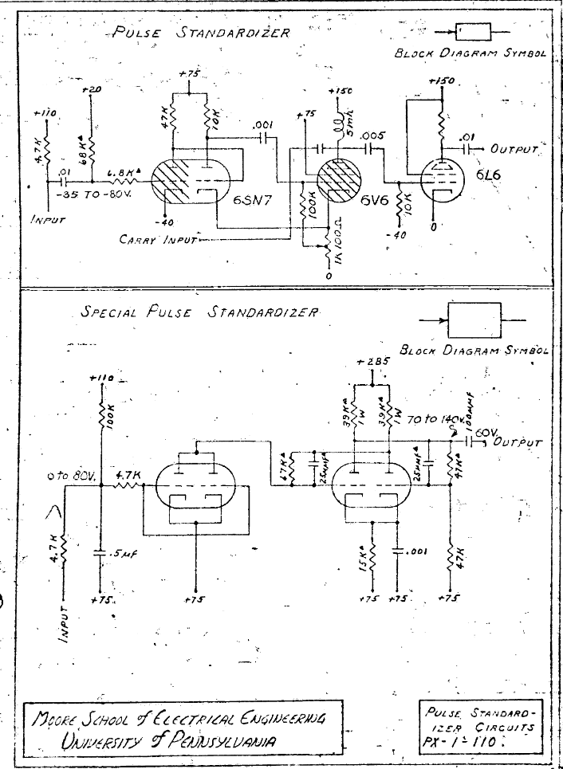

> Descrição da Imagem: Esquema elétrico do circuito padronizador de pulso. O estágio inicial utiliza a válvula de duplo tríodo 6SN7 configurada como um gatilho monoestável para regenerar as bordas retangulares da onda deformada, enquanto os estágios seguintes com as válvulas de potência 6V6 e 6L6 restauram a amplitude de tensão e fornecem corrente suficiente para o sinal percorrer as longas linhas da máquina.

### Pulse Amplifiers

Enquanto os circuitos padronizadores corrigiam a geometria temporal da onda, o ENIAC enfrentava um segundo obstáculo elétrico: a divisão de corrente e o refluxo de sinal. Quando uma unidade transmissora precisava rotear seus dados para múltiplos painéis receptores simultaneamente, a corrente elétrica do pulso se dividia entre as várias rotas, enfraquecendo a voltagem a níveis críticos. Além disso, interligar muitas unidades na mesma malha criava o risco de pulsos viajarem na contramão pelos cabos, causando colisões lógicas.

Para solucionar essa limitação de enfraquecimento da potência da corrente elétrica dividida e garantir o fluxo unidirecional dos dados, a arquitetura empregava unidades dedicadas chamadas Pulse Amplifiers.

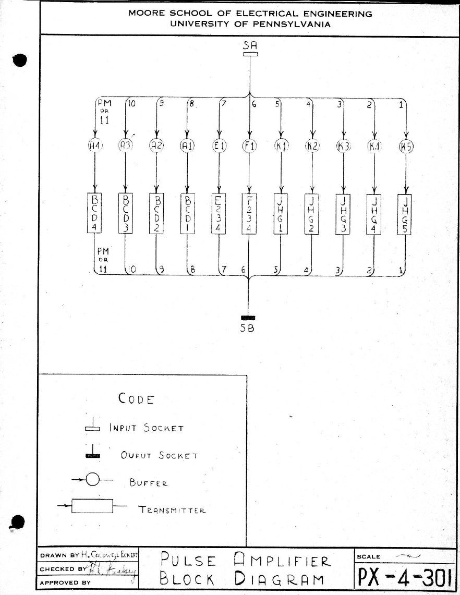

> Descrição da Imagem: Diagrama de blocos oficial de um Pulse Amplifier destinado aos Digit Trunks. A esquemática ilustra o roteamento paralelo das 11 vias de comunicação (10 linhas de magnitude e 1 linha de sinal). O sinal entrava pelo soquete superior (SA), passava por válvulas de isolamento (Buffers) e era retransmitido com potência total pelas válvulas de saída (Transmitters) até o soquete inferior (SB), garantindo que os dados fossem amplificados e impedindo fisicamente qualquer refluxo de corrente na rede.

Esses amplificadores atuavam como repetidores de sinal. As válvulas configuradas como Buffers recebiam o pulso degradado e isolavam a entrada da saída, funcionando como válvulas de retenção mecânica que só permitem a passagem em um sentido. Em seguida, o estágio de Transmitters injetava uma nova carga de corrente na linha, permitindo que o sinal numérico fosse distribuído para múltiplas unidades de destino sem perder sua integridade elétrica ou comprometer a polarização das grades receptoras.

### Extra

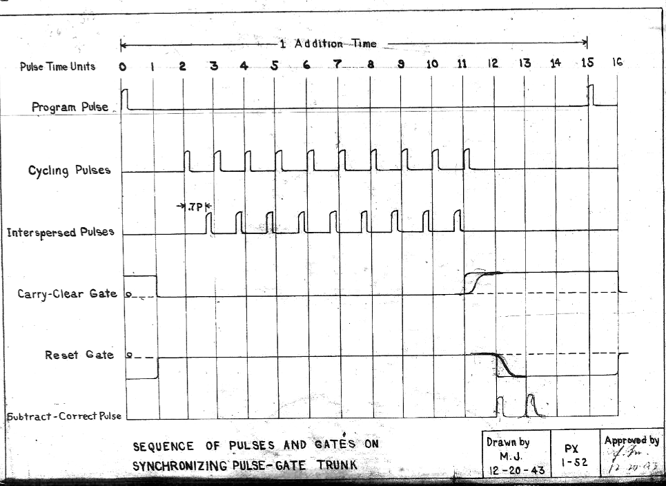

> Descrição da Imagem: Diagrama preliminar de temporização desenhado em dezembro de 1943, demonstrando a concepção inicial de um ciclo de adição de 16 tempos de pulso. O documento ilustra o planejamento embrionário da relação entre Cycling Pulses, Carry-Clear Gate e pulsos de programa, antes da expansão definitiva da máquina para o ciclo padrão de 20 tempos de pulso.

## 3.3 Synchronization

O Eniac utilizava uma arquitetura genial chamada de Unidade de Ciclos, um mecanismo centralizado e a fonte única da maquina toda. Gerando pulsos em intervalos de 10 microssegundos (10 µs). A taxa de atualização do projeto era de 100kHz (cem quilohertz), contudo, foi posteriormente usada apenas em 60kHz por motivos de estabilidade. 
Como a Unidade de Ciclos era a fonte única e centralizada do sistema, era impossível que houvesse desincronização por meios mecánicos. Visto que não havia outra fonte de pulsos para funcionar em paralelo. A complexidade no entanto, era garantir que esses pulsos se estendessem pelas dezenas de metros até todos os paíneis. Para lidar com esta dificuldade foram utilizados pares de cabos 6L6 excitados por um cabo 6V6. Esses eram Drivers que funcionavam como amplificadores do sinal da Unidade de Ciclos, esse sinal amplificado era enviado para o Synchronizing trunk, um feixe de 11 cabos (trey de jumpers) que conectava todos os paíneis simultanemante. Evitando um possivel delay nos paíneis mais distantes. 
Um fator importante de se notar era que os ciclos da Unidade de Ciclos, levavam exatamante 200 µs, e cada operação da máquina consumia um número inteiro de ciclos. Como o sinal de relógio gerado pela Unidade de Ciclos era recebido e amplificado no mesmo instante, a sincronia era garantida por construção.

E a Unidade de Ciclos funcionava em 3 modos. O contínuo, onde o relógio estava sempre ativo e constantemente gerando ciclos. O modo One add time. Onde os ciclos eram executados um por um em adição, muito usado para depuração. E o modo One pulse, onde era emitido apenas um pulso por vez, usado para gerar diagnósticos.

## 3.4 Trays
- As calhas ou racks usadas para organização dos cabos que levavam diferentes tipos de dados

## 3.5 Trunks
- Cabos responsáveis por enviar pulsos de digitos e de programa

## 3.6 Patch Cords & Plugs
- Configuração do roteamento de cabos

## 3.7 Cable Materials and Connectors

A integridade estrutural e elétrica das interconexões do sistema exigia materiais altamente duráveis e específicos para suportar as correntes elevadas, a alta tensão de polarização das válvulas e a necessidade de suportar o desgaste decorrente das frequentes reconfigurações mecânicas a cada novo cálculo. Os cabos e conectores eram classificados e construídos de acordo com sua função de roteamento.

### Cable Composition and Insulation
O núcleo condutor dos cabos responsáveis pelo transporte de sinais consistia em filamentos de cobre de baixa resistência ôhmica (fio puro e espesso o suficiente para corrente elétrica fluir sem sofrer oposição), reduzindo a perda de voltagem ao longo do trajeto e garantindo que os trens de pulso mantivessem corrente suficiente para polarizar as grades das válvulas nas unidades receptoras. Devido ao acoplamento direto de corrente contínua em alta voltagem, a fiação exigia um isolamento dielétrico (material isolante) espesso para conter os vazamentos de tensão elétrica.

Durante o desenvolvimento do projeto original, existia um risco físico e prático de degradação da malha por roedores. Para definir a composição química ideal do isolamento, J. Presper Eckert introduziu diversas amostras de fios encapados no interior de gaiolas com ratos cativos. O material dielétrico menos procurado e ignorado pelas cobaias foi selecionado como o composto isolante padrão de toda a máquina. Envolvendo esta proteção primária, a maioria das linhas também contava com revestimentos reforçados de tecido industrial e grossas jaquetas (capa externa do cabo) de borracha vulcanizada.

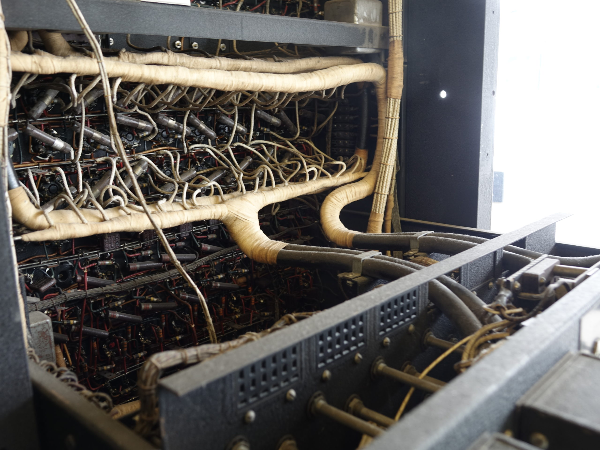

> Descrição da Imagem: Vista em profundidade do interior de um chassi do ENIAC, destacando os densos feixes de condutores protegidos por grossas bandagens de tecido industrial aplicadas em espiral. Esse revestimento têxtil contínuo fornecia isolamento elétrico suplementar e blindagem contra abrasão mecânica, impedindo que a vibração da sala desgastasse a borracha primária dos cabos contra as arestas metálicas do chassi. Em primeiro plano, observam-se linhas grossas de alimentação em jaqueta de borracha presas por braçadeiras metálicas, que se dividem nas ramificações superiores para distribuir as altas tensões de corrente contínua à malha densa de válvulas e resistores ao fundo.

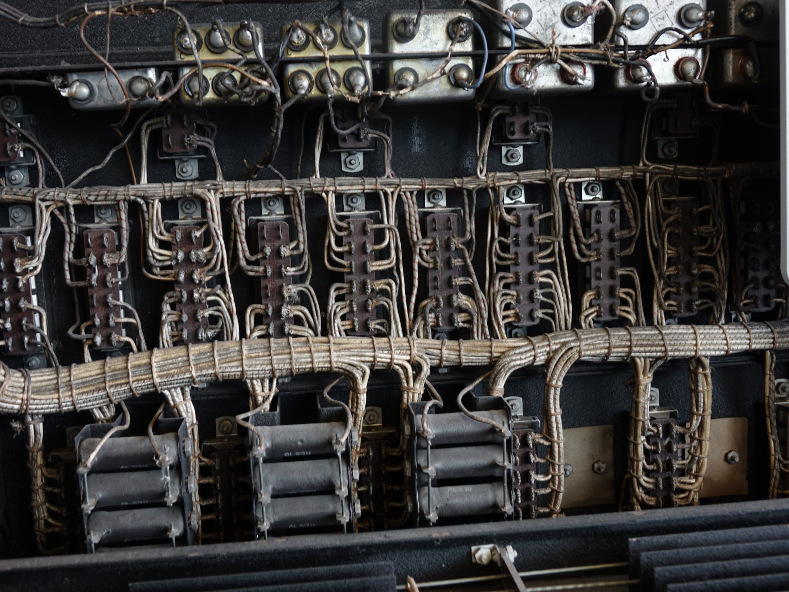

> Descrição da Imagem: Vista frontal do sistema de cabeamento interno estruturado por amarração clássica de cordel encerado. Cada condutor de cobre, encapado individualmente com isolamento dielétrico e capa trançada de tecido envernizado, é rigidamente alinhado em chicotes horizontais para eliminar folgas indutivas e movimentos residuais. As derivações em ângulo reto distribuem os circuitos diretamente para réguas de terminais soldadas em blocos de Bakelite marrom, demonstrando o método manual rigoroso empregado para isolar as linhas de polarização de alta voltagem dos bancos de resistores de potência instalados na base.

### Digit Trunks and Plugs
Para o roteamento horizontal e vertical do fluxo de processamento numérico, eram montados cabos densos chamados Digit Trunks. Esses cabos agregavam 11 linhas condutoras simultâneas debaixo da mesma jaqueta, servindo de via para 10 digit pulses e um pulso isolado direcional ou de sinalização (por isso o tamanho da palavra é 10 dígitos + 1 sinal. Se o número fosse negativo a linha de sinal ativava o gerador 9P, que enviava 9 pulsos seguidos num ciclo. Se o número fosse positivo, nenhum sinal passava aqui).

As extremidades estruturais destes cabos culminavam em terminais maciços fabricados primordialmente pela Amphenol (uma das maiores fabricantes Estadunidenses de conectores elétricos e componentes de radiofrequência da época da Segunda Guerra Mundial). Os invólucros externos e blocos de retenção térmica dos conectores eram moldados e usinados em Bakelite, um plástico termofixo de alta densidade fisicamente imune ao derretimento, oque era mandatório considerando o intenso ambiente de dissipação térmica do maquinário. Os pinos cilíndricos de contato encaixados na Bakelite eram forjados em latão e banhados em ligas de cobre, desenhados para estabilizar uma conexão de baixa impedância mesmo após serem plugados e desplugados milhares de vezes a face dos painéis.

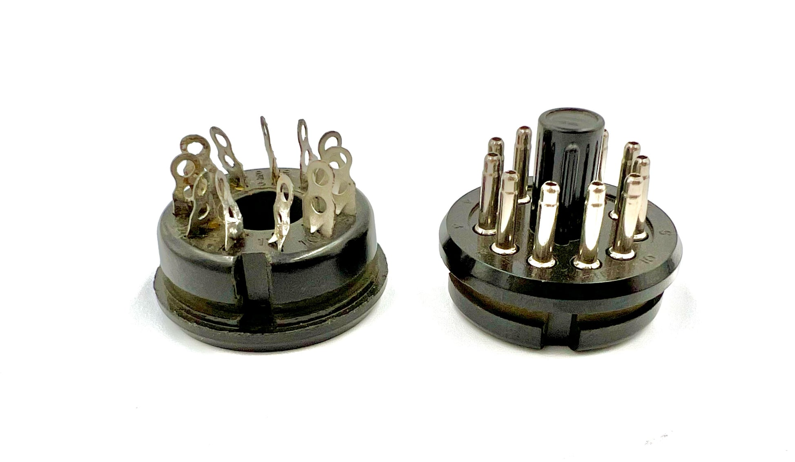
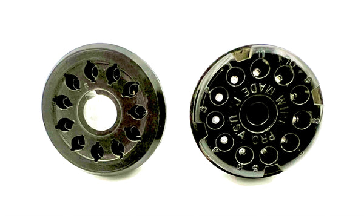

> Descrição das Imagens: Vistas em detalhe de um conector circular multipinos de 11 vias em Bakelite, característico dos terminais industriais produzidos pela Amphenol para os cabos de dados numéricos (Digit Trunks). Na imagem superior (vista lateral), destacam-se à esquerda os terminais perfurados de solda manual por onde entravam os condutores do feixe, e à direita os pinos cilíndricos de latão agrupados ao redor de um robusto pino-guia central ranhurado. Na imagem inferior, é visível o bloco termofixo preto com a numeração gravada em baixo-relevo de 1 a 11 na borda, alinhando fisicamente as 10 posições decimais da palavra do ENIAC e a linha isolada de sinal algébrico, evidenciando o relevo mecânico polarizado que impedia a inversão acidental de polaridade ou o encaixe desalinhado do cabo na face dos painéis.

### Coaxial Program Cables
Para o chaveamento de rotinas operacionais geridas pelos Program Pulses, era necessária a manutenção matemática das bordas de onda. Transmitir transições quadradas rigorosas de 2 microsegundos a uma taxa de 100 kHz por feixes de condutores paralelos comuns resultaria em dispersão capacitiva, arredondando as bordas do sinal e atrasando o disparo das válvulas receptoras.

> Nota: em repouso a linha era -345V. No início do pulso (que dura 2 microsegundos) ela sobe abruptamente para -290V, essa é a borda de subida, e se a subida for muito lenta a borda fica suave/arredondada (o que é ruim). A mesma coisa vale para a borda de descida. Se as bordas não estão bem definidas a duração do pulso fica confusa e pode ser lida incorretamente como um valor diferente que 2 microsegundos, oque pode causar falhas nos cálculos. Manutenção matemática das bordas se refere a manter essas bordas quadradinhas.

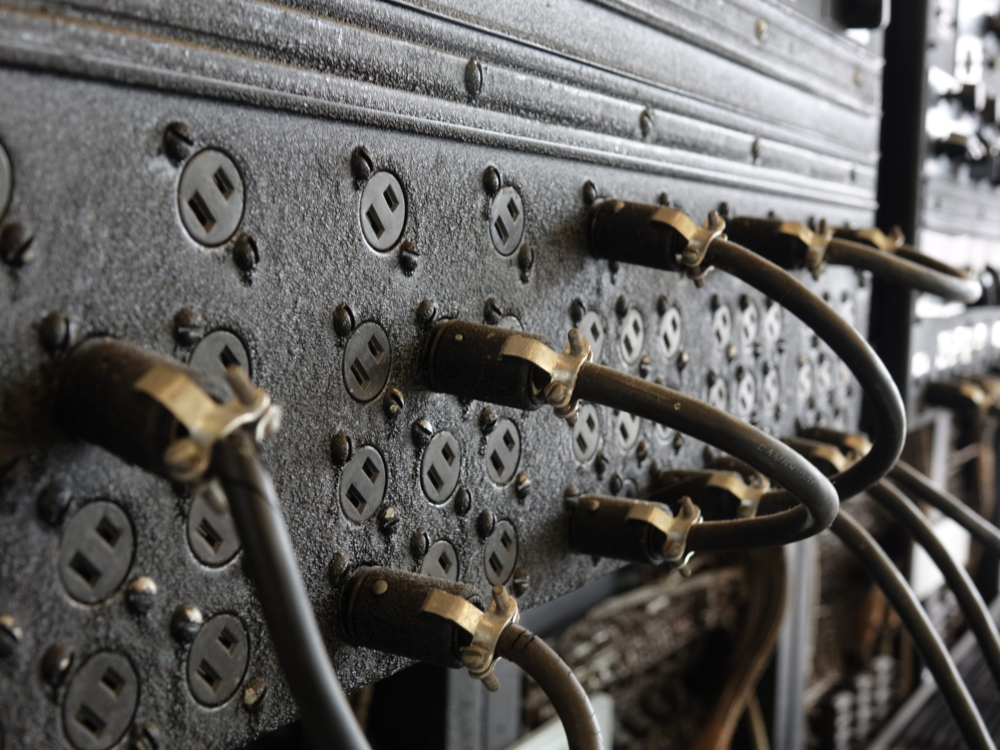

> Descrição da Imagem: Vista em close-up da face frontal de uma Program Tray evidenciando a infraestrutura de conexão dos cabos de manobra de controle (Program Cables). A superfície metálica em acabamento corrugado abriga uma matriz de receptáculos circulares bipolares de baquelite, onde cada ponto de conexão dispõe de dois contatos em fenda: uma via ativa para condução dos Program Pulses de alta tensão e uma via dedicada para o condutor de blindagem e retorno de aterramento. Destacam-se os corpos cilíndricos dos plugues emborrachados, reforçados por presilhas metálicas com molas de retenção parafusadas, projetadas para assegurar a blindagem eletrostática e impedir o desacoplamento mecânico sob a constante vibração industrial dos sistemas de resfriamento da máquina.

Para possibilitar o funcionamento das linhas de programa, esse obstáculo elétrico foi superado utilizando estritamente cabos coaxiais de rádio frequência. Uma densa malha trançada de cobre operava como um cilindro de blindagem em torno do condutor elétrico sólido central, mitigando a capacitância parasita e inibindo por completo a interferência de campo eletromagnético transversal entre as incontáveis rotas agrupadas horizontalmente nas calhas. Os terminais dos cabos coaxiais aplicavam um pino central rígido, encapsulado por um anel metálico de aterramento fixado por rosca, cravando o sinal elétrico puro de controle de forma direta nas portas de entrada dos amplificadores regeneradores.

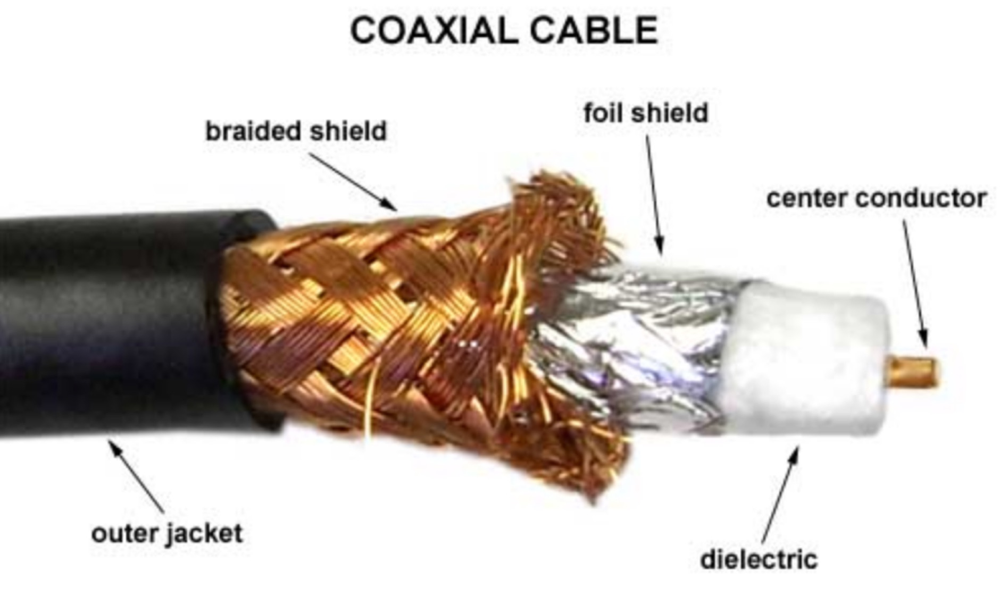

> Descrição da Imagem: Diagrama das camadas estruturais de um cabo coaxial. O condutor central transporta os pulsos de sinal de alta frequência, envolto por uma camada espessa de isolamento dielétrico. Ao redor deste conjunto, a malha trançada de cobre (braided shield) conectada ao terra atua como uma barreira física que bloqueia interferências eletromagnéticas externas e contém a dispersão de campo, preservando as bordas retangulares do sinal.

> Nota: Ainda que o cabo coaxial preservasse o formato do sinal melhor que fios convencionais, as perdas resistivas ao longo de dezenas de metros continuavam presentes, tornando obrigatório o uso periódico dos Pulse Standardizers nas unidades de destino para restaurar a amplitude e os cantos retangulares da onda. (Mais detalhes sobre isso no tópico 3.2, subtópico Pulse Standardizers)

### Portable Units and Umbilical Cabling
Além dos cabos de manobra locais e dos barramentos horizontais nas calhas, a operação do ENIAC dependia de interconexões pesadas para integrar periféricos móveis, com destaque para a Tabela de Funções Portátil. Por se tratar de um painel montado sobre rodízios e sem válvulas ativas internas, a leitura de suas matrizes de interruptores manuais exigia uma linha umbilical de transmissão estática direta com os painéis principais da máquina.

Ao contrário das linhas dinâmicas de 11 vias dos Digit Trunks, o cabo de conexão da Tabela de Funções agregava dezenas de condutores paralelos sob uma espessa blindagem mecânica. Como o periférico operava no centro da sala e precisava ser manobrado livremente, o cabo era exposto a atrito e pisoteamento constante. A proteção contra desgaste era garantida por uma jaqueta externa tubular tecida em malha de cobre estanhado ou aço, que atuava simultaneamente como barreira contra abrasão mecânica e malha de aterramento contínuo.

A elevada quantidade de linhas condutoras exigiu o desenvolvimento de terminais multipinos de escala industrial. A força de atrito somada de quase uma centena de pinos de latão sob pressão tornava impossível o engate manual convencional; por essa razão, os blocos de termofixo eram encapsulados por carcaças de metal fundido equipadas com alças rígidas de alavancagem, assegurando a inserção firme do conector e impedindo que os operadores tracionassem os fios internos durante o desengate.

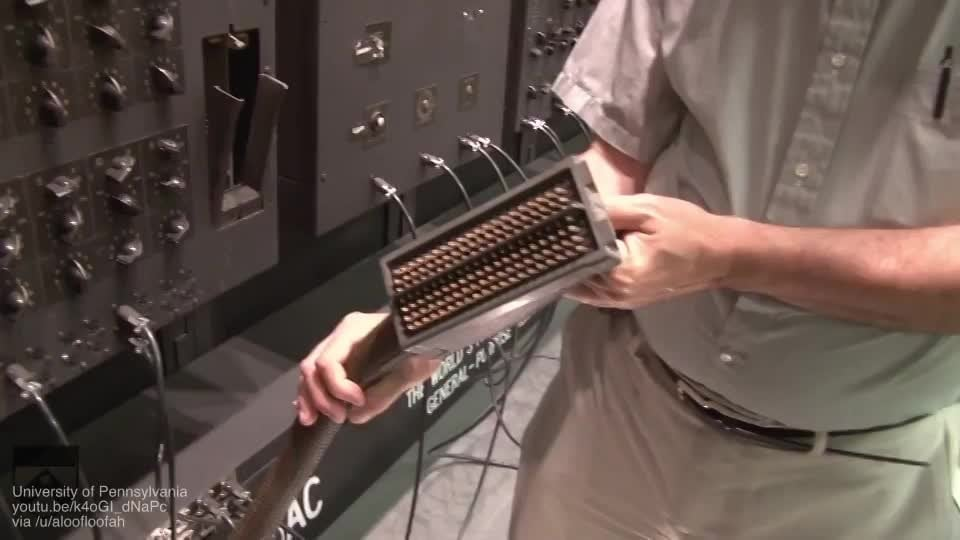
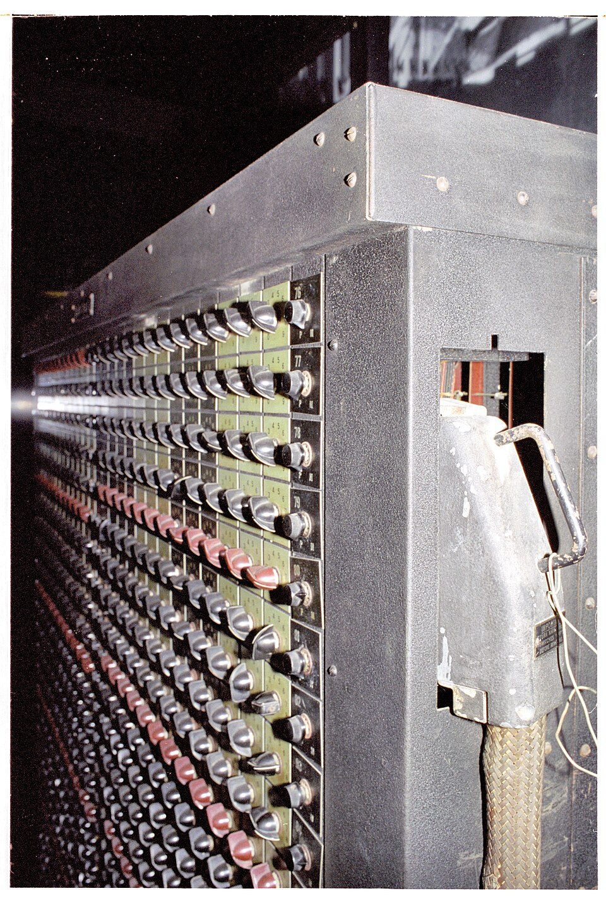
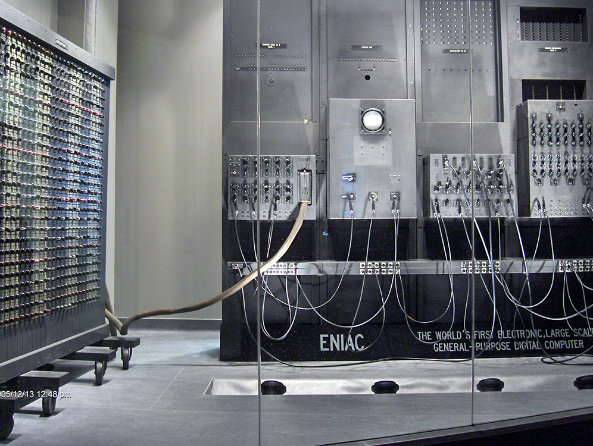

> Descrição das Imagens: Sequência de imagens evidenciando a escala física, anatomia e operação do cabo umbilical blindado da Tabela de Funções Portátil. Na primeira imagem, o conector multipinos retangular sustentado manualmente revela a matriz de dezenas de pinos de contato em latão embutidos em um bloco termofixo denso, demonstrando o peso e a robustez necessários para trafegar barramentos massivos de dados em paralelo. Na segunda imagem, o terminal acoplado à lateral da unidade evidencia o invólucro de proteção metálica fundida dotado de uma alça rígida de manobra (que era exigida para exercer a força mecânica necessária durante o engate e desengate de dezenas de contatos sob pressão), bem como a densa malha trançada de aterramento e proteção mecânica que reveste o condutor. Na terceira imagem, a visão panorâmica exibe a Tabela de Funções móvel interligada aos painéis estacionários principais por esse cabo enorme, ilustrando a infraestrutura exigida para integrar periféricos móveis à malha elétrica central do ENIAC.

### Cable Dimensions, Geometry and Color Coding
Para facilitar a montagem lógica dos circuitos e evitar erros humanos, os cabos do ENIAC eram rigorosamente padronizados em sua geometria, comprimento físico e identificação visual:

- Padronização de Comprimentos e Capacitância: A equipe dispunha de um inventário de cabos pré-fabricados em comprimentos diferentes: jumpers curtos (utilizados para conexões entre bornes vizinhos no mesmo painel), cabos médios (para interligar calhas contíguas) e cabos de extensão longa (que percorriam as bandejas metálicas pelas paredes da sala). Utilizar o cabo de menor comprimento possível para cada conexão era muito importante, pois cabos excessivamente compridos deixavam folgas enroladas, o que aumentava a indutância e a capacitância parasita do circuito, deformando a borda dos pulsos. O manual de operações da máquina impunha diretrizes rígidas de preservação física: era expressamente proibido realizar dobras angulares fechadas nas linhas coaxiais para não esmagar o isolamento dielétrico interno, bem como deixar cabos suspensos em direção ao chão da sala de controle.

> Nota: A indutância é a propriedade que um condutor elétrico tem de se opor a variações bruscas na intensidade da corrente elétrica, armazenando energia temporariamente em um campo magnético. Por agir como uma inércia que tenta forçar a corrente a continuar no mesmo ritmo, ela reage a cortes ou disparos rápidos de sinal gerando tensões opostas e oscilações elétricas transitórias que, em linhas longas ou cabos com folgas enroladas, gera ruídos e repiques na forma de onda dos pulsos.

- Codificação Visual por Cores: Dada a presença de milhares de condutores sobrepostos nas faces dos 40 painéis, a distinção rápida das vias era garantida por revestimentos têxteis e jaquetas coloridas. A malha externa dos cabos recebia pigmentações distintas (como preto, marrom, amarelo e padrões trançados mesclados) que permitiam aos operadores identificar de relance o comprimento da fiação e a natureza da linha sem precisar rastrear visualmente toda a extensão do condutor pelas calhas.

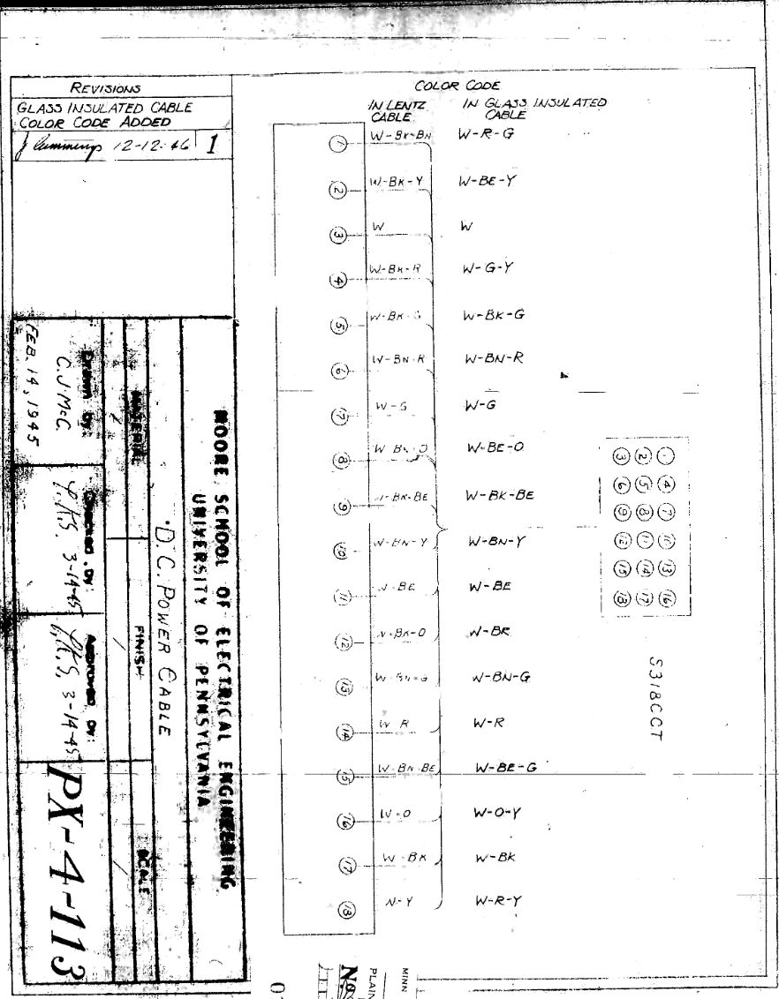

> Descrição da Imagem: Documento detalhando o esquema de codificação por cores utilizado no isolamento dos cabos do ENIAC. A tabela lista as abreviações das malhas pigmentadas (como W-Bk-Y para Branco-Preto-Amarelo), demonstrando o sistema visual criado para que os operadores pudessem rastrear linhas específicas no meio da densa teia de fios da máquina.

- Travamento Mecânico e Failsafes de Soquetes: Para que cabos não fossem conectados em entradas erradas por acidente e a separação entre os diferentes tipos de dados fosse mantida, o desenho dos próprios plugues impedia conexões problemáticas. Os conectores multipinos circulares da Amphenol destinados aos Digit Trunks possuíam guias mecânicas de encaixe por ranhura, impedindo que o plugue fosse inserido invertido ou desalinhado. Ao mesmo tempo, os cabos coaxiais de Program Pulses utilizavam conectores coaxiais de pino único e anel de rosca. Essa incompatibilidade dimensional tornava mecanicamente impossível conectar uma linha de pulsos de programa em uma tomada de dados decimais.

- Adaptadores Rígidos de Deslocamento: Além dos cabos flexíveis, o sistema empregava adaptadores rígidos externos conhecidos como Shifters e Deleters. Esses eram módulos compactos de Bakelite (um tipo de plástico) dotados de plugues macho e fêmea com fiação interna transposta. Ao interpor um Shifter entre o terminal do cabo e o soquete do painel frontal, as linhas internas dos dígitos eram desviadas fisicamente em uma ou mais posições para a esquerda ou para a direita, realizando multiplicações ou divisões por potências de dez de forma puramente eletromecânica antes que os pulsos atingissem os acumuladores receptores.

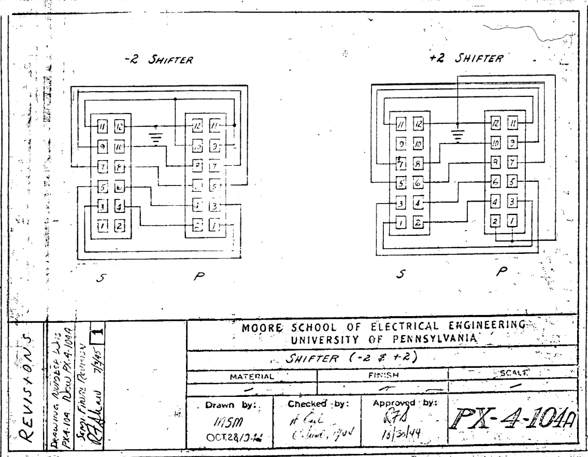

> Descrição da Imagem: Diagrama oficial ilustrando a fiação interna de um Shifter (-2 & +2). A imagem revela como as linhas condutoras eram fisicamente transpostas entre os soquetes de entrada (S) e saída (P), permitindo ao ENIAC realizar multiplicações ou divisões por potências de dez de forma instantânea e puramente eletromecânica, sem a necessidade de processamento lógico.

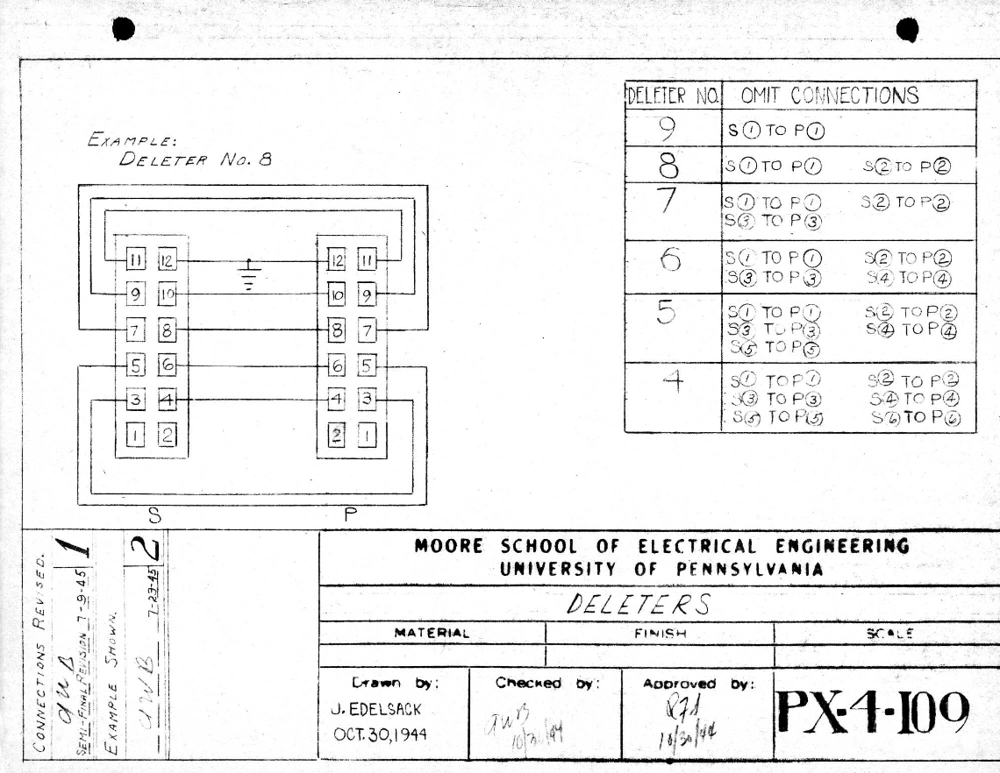

> Descrição da Imagem: Desenho técnico de um adaptador Deleter. Diferente do Shifter, que cruzava os cabos, a tabela à direita do diagrama evidencia como o Deleter interrompia intencionalmente vias específicas de comunicação (omit connections), filtrando pulsos indesejados antes que chegassem ao painel de destino.

## 3.8 Setup Complexity

As maiores dificuldades relatadas pela equipe estavam relacionadas em principal aos cabos e outros erros decorrentes deles. A primeira parte envolvia o tempo e o esforço, pois, cada problema a ser excutado precisava da organização de milhares de cabos em aproximadamente 40 plugboards. Cada um com metros de de largura. Somente a etapa de configuração física levava varios dias, e a verificação podia levar ainda mais tempo. Havia por efeito, erros de depuração, onde um cabo mal encaixado, ou switch mal posicionado era extremamente dificil de encontrar. Ainda não havia nenhuma estrutura de Trace ou Breakpoint nativo. A equipe na verdade desenvolveu a ténica de Break point. Puxando um cabo de um soquete para interromper a cadeia de pulsos e congelando a máquina. Permitindo inspeciona-la internamnete. Ainda assim, a equipe constatava que era "Absurdamente difícil" de solucionar o problema. Por fim havia os erros gerados por operações concorrentes. Como o Eniac executava as operções aritimeticas e de transferẽncia de forma simultanea, a programação se tornava um desafio a parte. Visto que era preciso planejar meticulosamente a sequência dos cabos para que as operações paralelas não entrassem em conflito. foi apenas após a intervenção de Jonh Von Neumann que introduziu um código de de conversor para forçar a operação de forma serial que este problema foi resolvido. 

## 3.9 Absence of Address Bus

O Eniac não necessitava de um Barramento, e isso ocorria justamente por sua arquitetura. Já que ele não tinha memória de instrução para que pudesse ser endereçada. Em suma, O Eniac não tinha memória, pois o "Programa" era estruturado pela junção de cabos e soquetes, logo o endereçamento era direto e fisíca no próprio hardware do sistema. As operações feitas eram padronizadas pela fiação e pelos interruptores, e até mesmo as tabelas de função utilizadas eram acessadas por fiação fixa. Em termos técnicos, o Eniac funcionava mais como um grafo de fluxo do que como uma CPU diretamente. Sem conexões e programas extras a serem utilizados. Sem necessidade de barramento.

## 3.10 Other Interconnections Diagrams (Because They are Cool!)

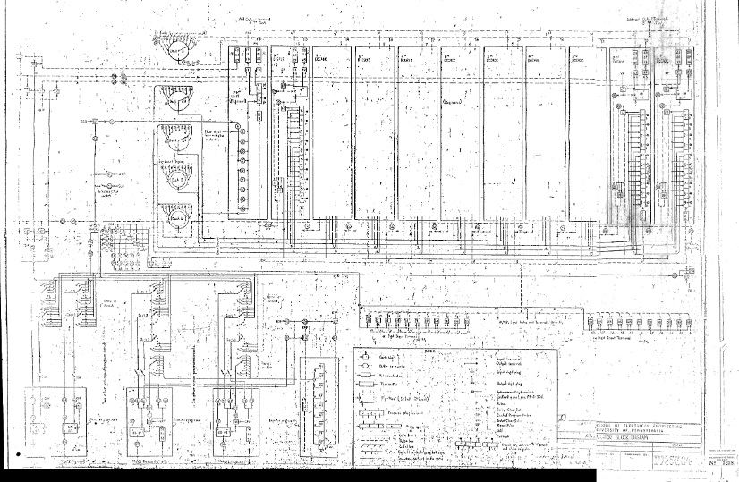

> Descrição da Imagem: O esquema ilustra a arquitetura lógica da unidade responsável por armazenar e realizar adições/subtrações. Em destaque, alinhados lado a lado, estão os dez blocos verticais rotulados de "1st Decade" a "10th Decade", que representam os contadores de anel em cascata para um número decimal de 10 dígitos, precedidos à esquerda pelo circuito indicador de sinal (PM - Plus/Minus). O diagrama também detalha o complexo roteamento interno: a interface com as vias de dados (Digit Trunks) na parte superior e a rede de chaves seletoras circulares e circuitos de controle (Program Lines) nas seções inferior e lateral esquerda, que coordenavam a entrada, saída e limpeza dos valores.

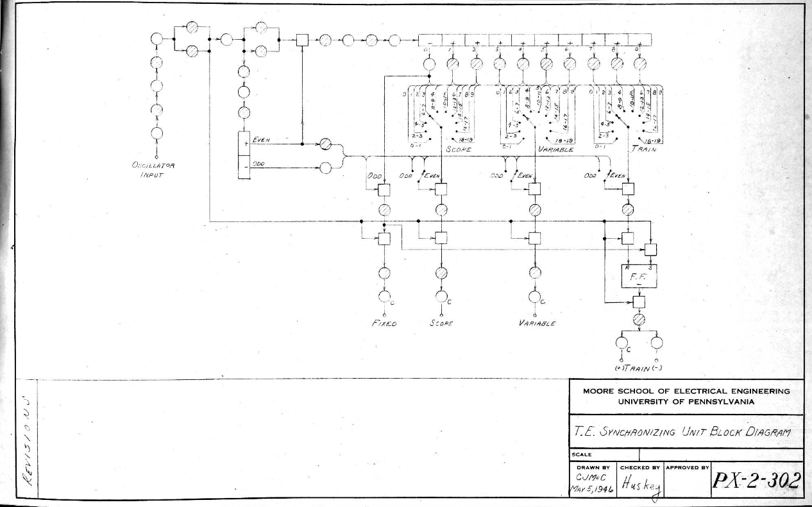

> Descrição da Imagem: Diagrama de blocos oficial da Unidade de Sincronização de Equipamento de Teste do ENIAC, 1946. O esquema detalha a lógica do circuito utilizado para gerar e isolar pulsos de tempo precisos para fins de diagnóstico e calibração da máquina. À esquerda, o sinal de entrada (Oscillator Input) é condicionado e alimenta um contador sequencial no topo (estágios de 0 a 9). O destaque para os três conjuntos de chaves seletoras rotativas rotuladas como SCORE (ou SCOPE, não dá para ver muito bem), VARIABLE e TRAIN, que permitiam aos engenheiros selecionar pulsos em tempos específicos. Esses sinais passavam por uma lógica de separação de ciclos pares e ímpares (Even/Odd) e por um Flip-Flop (F.F.) antes de chegarem aos terminais de saída na base, servindo para sincronizar osciloscópios e injetar trens de pulso de teste em outras unidades.

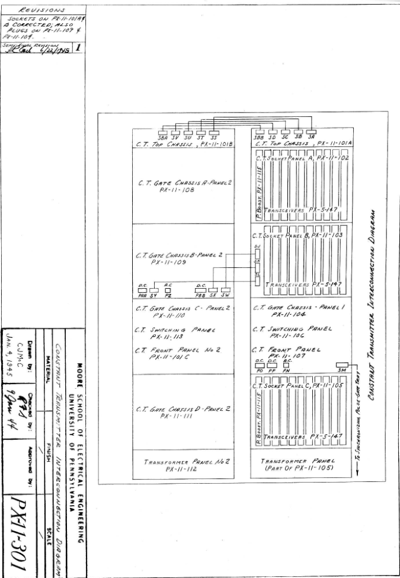

> Descrição da Imagem: Diagrama de interconexão oficial do Constant Transmitter (Transmissor de Constantes) do ENIAC. O esquema mapeia a disposição física e o cabeamento estrutural entre os diversos chassis que compõem os dois painéis principais desta unidade, que era responsável por introduzir dados (lidos de cartões perfurados) na máquina. A ilustração detalha a organização vertical dos módulos, incluindo os Top Chassis com seus soquetes de interligação no topo, múltiplos Gate Chassis e Switching Panels na região central, e Transformer Panels na base. Na coluna da direita, destacam-se os Socket Panels (A, B e C) abrigando conjuntos de Transceivers, componentes relacionados a conversão e transmissão dos dados numéricos para o resto do computador.

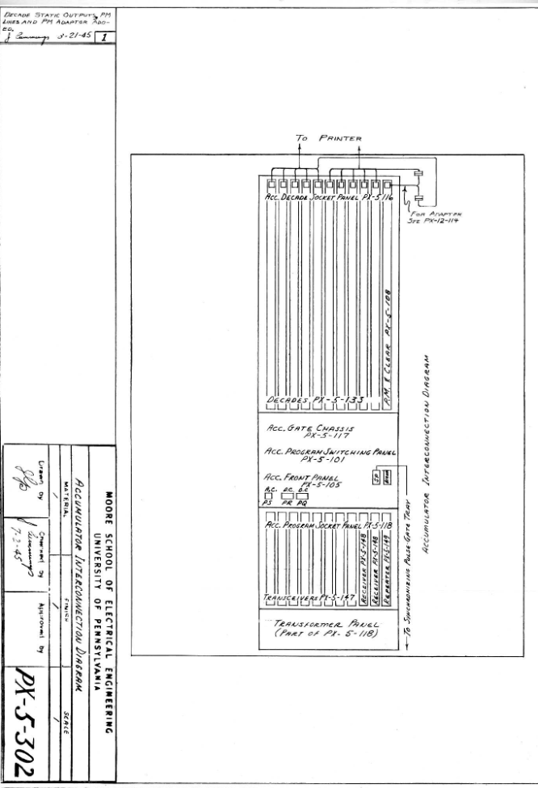

> Descrição da Imagem: Diagrama de interconexão oficial de um Acumulador do ENIAC. O esquema mapeia a disposição física e estrutural dos módulos no painel da unidade. Na parte superior, destacam-se os dez chassis verticais das décadas contadoras (Decades) e o módulo de controle de sinal e limpeza (P.M. & Clear), com o cabeamento de saída direcionado para a unidade de impressão (To Printer). A seção central detalha os chassis de portas lógicas (Gate Chassis) e o painel de chaves de programação (Program Switching Panel). Na base, o diagrama ilustra o painel de soquetes de programa abrigando componentes vitais de comunicação, como transceptores (Transceivers), receptores e repetidores, além de indicar a rota de conexão para a bandeja de pulsos de sincronização (To Synchronizing Pulse-Gate Tray).

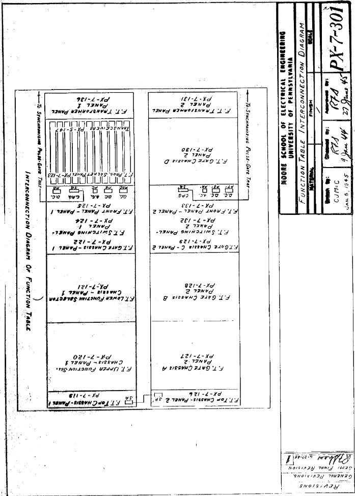

> Descrição da Imagem: Diagrama de interconexão oficial da Function Table (Tabela de Funções) do ENIAC. O esquema detalha a disposição física e a organização estrutural dos dois painéis verticais (Panel 2 à esquerda e Panel 1 à direita) que compõem a unidade responsável por armazenar valores tabulares fixos. No Painel 2, observam-se múltiplos módulos de portas lógicas (Gate Chassis A, B, C e D) e chaves (Switching Panel). No Painel 1, destacam-se os chassis seletores de função superior e inferior (Upper/Lower Function Selector Chassis), essenciais para o endereçamento e leitura dos dados, além do painel de soquetes de programação (Prog. Socket Panel) equipado com matrizes de transceptores (Transceivers) logo acima do transformador base. O diagrama também indica as conexões de alimentação (A.C./D.C.) e as linhas de controle direcionadas à bandeja de pulsos de sincronização (To Synchronizing Pulse-Gate Tray)

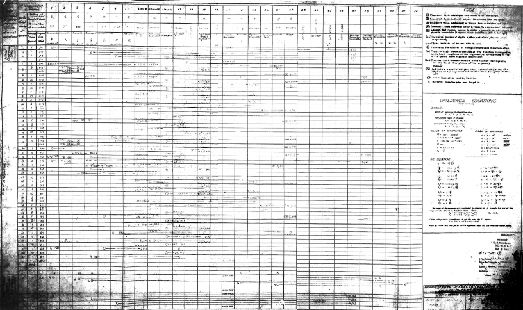

> Essa imagem representa uma estrutura lógica específica do Eniac. Utilizada para calcular a rota de misseis balistícos usando o Método de Heun. Era uma espécie de mapa de programação de como os cabos e estruturas (como o acumulador) já citadas anteriormente deveriam ser configurados para que o calculo fosse feito da forma desejada.
> O conteúdo da imagem da "Tabela de equações do setup de exteriror balistíco." foi redigida em 31 de dezembro de 1943. Isso foi alguns meses antes do projeto final do Eniac estar montado e apto a testes. O que significa que mesmo antes de tudo estar pronto e ser montado, o grupo de cientistas e pesquisadores já estavam colocando em prática a lógica e "programção" de possiveis algoritmos que o Eniac viesse a usar. [Nota pessoal: Os pesquisadores estavam literalmente programando no lápis e papel. Loucura][Outra Nota: E depois eles estavam programando com cabos, oque também é muito impresionante]

## Footnotes

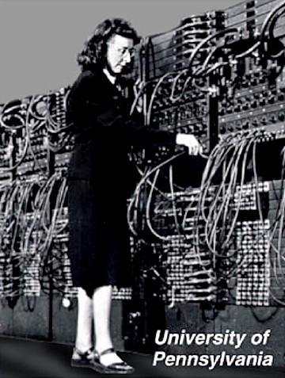

> Essa imagem poderia ser a capa de um álbum

