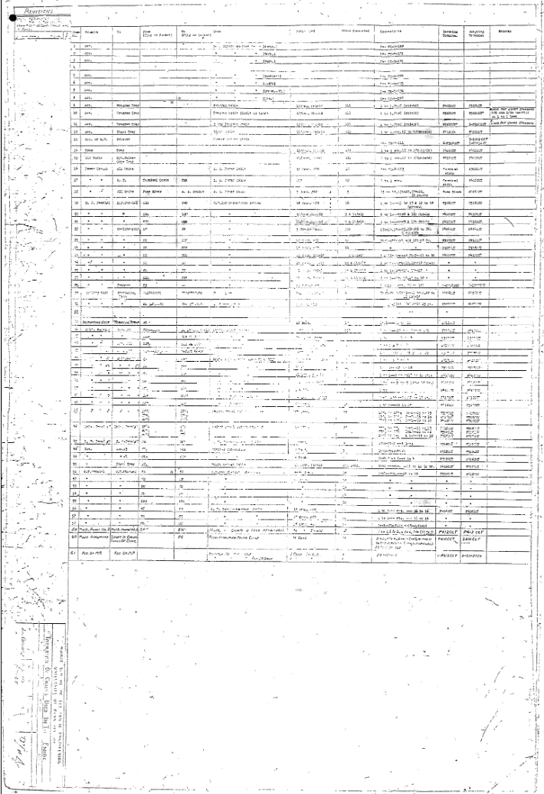

# 3. Interconnections

  

## 3.1 Cabling Overview

A interconexão dos 40 painéis modulares do ENIAC era realizada por um sistema de cabeamento estritamente segmentado e roteado de acordo com a função elétrica. A estrutura de comunicação e alimentação da máquina era dividida em três formas principais de cabeamento:

### 3.1.1. Backplate Cabling
Calhas de energia distribuíam as linhas de corrente contínua (DC) para as placas dos tubos e corrente alternada (AC) para os circuitos de aquecimento dos filamentos das válvulas. Nenhum dado numérico ou pulsos elétricos trafegavam por essa área.

### 3.1.2. Internal Cabling
Dentro de cada um dos 40 painéis, as conexões entre os tubos de vácuo, resistores, capacitores e relés eram fixas e soldadas diretamente nos chassis. Essa fiação interna resolvia a lógica local da unidade, as vias por onde o processamento era realizado.

> Descrição da Imagem: Vista inferior de um chassi modular plugável do ENIAC, evidenciando o cabeamento interno e a fiação ponto a ponto soldada manualmente. Destaque para a malha de barramentos de cobre, resistores, capacitores e o conector elétrico multipinos na extremidade inferior direita, utilizado para encaixar o módulo na estrutura fixa do painel.

> Descrição da Imagem: Demonstração da escala física dos componentes internos do ENIAC e sua evolução. À esquerda, uma operadora segura uma unidade decádica modular completa retirada de um dos painéis, revelando a densidade e o tamanho dos chassis de válvulas que compunham os circuitos internos da máquina.

### 3.1.3 Frontal Cabling
Comunicação global entre unidades distintas ocorria exclusivamente na parte exterior da máquina. Para suportar o peso e organizar a enorme quantidade de fios necessários para interligar os painéis que podiam estar a vários metros de distância, o ENIAC utilizava um sistema de calhas metálicas horizontais chamadas de bandejas.
Essas bandejas percorriam toda a extensão das paredes da sala, fixadas na estrutura dos painéis. As bandejas inferiores e intermediárias acomodavam os cabos longos, enquanto as conexões diretas eram feitas plugando as extremidades desses cabos nos soquetes expostos nos painéis frontais e painéis de interruptores de cada unidade. A topologia da rede era definida pela disposição desses cabos frontais, cabos esses que permitiam à máquina operar de forma altamente paralela, conectando conjuntos de unidade que poderiam operar simultaneamente.

  

> Descrição da Imagem: Desenho técnico da face frontal de um Acumulador evidenciando a infraestrutura de cabeamento da unidade. Destaque para a passagem horizontal das Digit Trays na região intermediária (calhas que acomodavam os cabos de 11 vias para tráfego numérico) e das Program Trays na base do painel (calhas para os cabos de pulsos de sincronismo e controle), demonstrando os pontos físicos exatos onde os cabos flexíveis eram plugados para conectar a unidade ao restante da máquina.

O sistema de cabos frontais no ENIAC foi fortemente inspirado nas centrais telefônicas da época. Como as operadoras já tinham familiaridade (ou podiam aprender facilmente) com essa interface, a equipe projetou os painéis de forma análoga à ela, definindo o roteamento de fluxo de dados fisicamente ligando uma unidade para "conversar" com outra.

> Descrição da Imagem: Diagrama esquemático de interconexão entre os Acumuladores 1 a 8 e as calhas de cabeamento durante um cálculo balístico. Destaque para a separação física entre as Digit Trunks no topo (cabos de 11 vias para transporte de dados numéricos) e as Program Lines na base (cabos para pulsos de controle), interligadas aos painéis por conexões verticais (patch cords) que definem a rota dos dados e a ordem de disparo das operações.

## 3.2 Signal Types

> Descrição da Imagem: Painéis originais do ENIAC em exibição na Universidade da Pensilvânia. O segundo painel vertical a partir da esquerda é a Unidade Cíclica (identificável pela tela circular do osciloscópio central, usada no monitoramento do clock de 100 kHz), ladeada por uma Tabela de Função portátil à esquerda, um Acumulador e o Programador Mestre à direita, todos interligados por cabos nas calhas inferiores.

Um pulsso no ENIAC é uma variação transitória e rápida de potencial elétrico em uma linha condutora. Em repouso, as linhas operavam polarizadas com alta tensão negativa (geralmente -345V de corrente contínua para acoplamento direto com as grades das válvulas). Quando um tubo transmissor entrava em saturação, ele injetava corrente na linha, elevando abruptamente o potencial para -290V por cerca de 2 microsegundos (ou 0,000002 segundos) antes de retornar ao repouso (pulso elementar contínuo de trabalho da máquina).

> Descrição da Imagem: Diagrama temporal oficial da Unidade Cíclica, ilustrando as formas de onda, níveis de tensão e janelas de atuação durante um ciclo de adição, que dura 200 microsegundos. Mais detalhes abaixo.

Toda a operação do sistema era regida por três categorias de sinais elétricos sincronizados pela Unidade Cíclica e encapsuladas em um ciclo de 200 microsegundos (dividido em 20 tempos, cada tempo possuindo 10 microsegundos):

### 3.2.1. Digit Pulses
Os dados trafegavam em base decimal através de trens de pulso emitidos na primeira metade do ciclo (tempos 1/20 a 10/20). A Unidade Cíclica não possuía geradores dedicados para cada um dos números de 1 a 9, em vez disso, ela gerava blocos fundamentais de pulsos com durações e espaçamentos temporais específicos:
- 1P: Emite 1 pulso no tempo 1/20
- 2P: Emite 2 pulsos sequenciais nos tempos 2/20 e 3/20
- 2'P: Emite 2 pulsos sequenciais nos tempos 4/20 e 5/20 (separados do 2P para evitar sobreposição)
- 4P: Emite 4 pulsos nos tempos de 6/20 a 9/20
- 1'P: Emite 1 pulso isolado no tempo 10/20
Qualquer número de 1 a 9 era sintetizado combinando essas linhas através de portas lógicas. Exemplo: o dígito 7 era formado pela soma lógica de 1P + 2P + 4P.
As saídas 9P e 10P eram pré-fabricados com 9 e 10 pulsos contínuos, sendo utilizados prioritariamente para operações de complemento de dez e aritmética de número negativos.

### 3.2.2. Program Pulses
Os comandos e transições de rotina utilizavam pulsos unitários mais discretos:
- O Central Programming Pulse (CPP) era um pulso mestre gerado pontualmente no tempo 17/20 de cada ciclo. Quando uma unidade encerrava seu cálculo, seu circuito liberava a passagem do CPP daquele ciclo para seu borne de saída. Esse pulso viajava pelas bandejas de programa até a entrada de outra unidade, despolarizando as grades das válvulas de corte e acionando o início do próximo cálculo em perfeitamente sincronizado com a Unidade Cíclica.

### 3.2.3. Gate Signals
Diferente dos pulsos curtos de 2 microsegundos, uma Porta era uma elevação contínua de tensão mantida estável para habilitar ou desabilitar válvulas pentodo (como as 6V6, operando como portas lógicas AND):
- Carry-Clear Gate: Janela temporal contínua que permanecia ativa entre os tempos 11/20 e 18/20 (70 microsegundos). Esse sinal desobstruía os circuitos de transporte de dezenas, permitindo que os contadores repassassem o "vai-um" gerado pela adição aos estágios seguintes sem colidir com os dados de dígitos (que haviam terminado no tempo 10).
- Reset Pulses: Pulsos de limpeza referenciados em 0V (com pico em +50V) disparados no tempo 13/20 e no tempo 19/20. O pulso 13 reiniciava os gatilhos de transporte, e o pulso 19 zerava os estados transitórios dos acumuladores, deixando todas as linhas estabilizadas para o tempo 0 do ciclo subsequente.

Conforme esses diferentes tipos de sinais viajavam por dezenas de metros de cabos e bandejas, as perdas capacitivas e resistivas deformavam as ondas quadradas e derrubavam os -290V nominais. Para que as válvulas operassem de modo confiável, circuitos padronizadores utilizavam tubos duplos 6SN7 para detectar o limiar da onda degradada e recriar bordas retangulares afiadas, enquanto tubos de potência 6V6 e 6L6 restauravam a amplitude de tensão antes de encaminhar o sinal para a unidade de destino.

> Descrição da Imagem: Esquema elétrico do circuito padronizador de pulso. O estágio inicial utiliza a válvula de duplo tríodo 6SN7 configurada como um gatilho monoestável para regenerar as bordas retangulares da onda deformada, enquanto os estágios seguintes com as válvulas de potência 6V6 e 6L6 restauram a amplitude de tensão e fornecem corrente suficiente para o sinal percorrer as longas linhas da máquina.

### Extra

> Descrição da Imagem: Diagrama preliminar de temporização desenhado em dezembro de 1943, demonstrando a concepção inicial de um ciclo de adição de 16 tempos de pulso. O documento ilustra o planejamento embrionário da relação entre Cycling Pulses, Carry-Clear Gate e pulsos de programa, antes da expansão definitiva da máquina para o ciclo padrão de 20 tempos de pulso.

## 3.3 Synchronization

O Eniac utilizava uma arquitetura genial chamada de Unidade de Ciclos, um mecanismo centralizado e a fonte única da maquina toda. Gerando pulsos em intervalos de 10 microssegundos (10 µs). A taxa de atualização do projeto era de 100kHz (cem quilohertz), contudo, foi posteriormente usada apenas em 60kHz por motivos de estabilidade. 
Como a Unidade de Ciclos era a fonte única e centralizada do sistema, era impossível que houvesse desincronização por meios mecánicos. Visto que não havia outra fonte de pulsos para funcionar em paralelo. A complexidade no entanto, era garantir que esses pulsos se estendessem pelas dezenas de metros até todos os paíneis. Para lidar com esta dificuldade foram utilizados pares de cabos 6L6 excitados por um cabo 6V6. Esses eram Drivers que funcionavam como amplificadores do sinal da Unidade de Ciclos, esse sinal amplificado era enviado para o Synchronizing trunk, um feixe de 11 cabos (trey de jumpers) que conectava todos os paíneis simultanemante. Evitando um possivel delay nos paíneis mais distantes. 
Um fator importante de se notar era que os ciclos da Unidade de Ciclos, levavam exatamante 200 µs, e cada operação da máquina consumia um número inteiro de ciclos. Como o sinal de relógio gerado pela Unidade de Ciclos era recebido e amplificado no mesmo instante, a sincronia era garantida por construção.

E a Unidade de Ciclos funcionava em 3 modos. O contínuo, onde o relógio estava sempre ativo e constantemente gerando ciclos. O modo One add time. Onde os ciclos eram executados um por um em adição, muito usado para depuração. E o modo One pulse, onde era emitido apenas um pulso por vez, usado para gerar diagnósticos.

## 3.4 Trays
- As calhas ou racks usadas para organização dos cabos que levavam diferentes tipos de dados

## 3.5 Trunks
- Cabos responsáveis por enviar pulsos de digitos e de programa

## 3.6 Patch Cords & Plugs
- Configuração do roteamento de cabos

## 3.7 Cable Materials and Connectors

A integridade estrutural e elétrica das interconexões do sistema exigia materiais altamente duráveis e específicos para suportar as correntes elevadas, a alta tensão de polarização das válvulas e a necessidade de reconfiguração mecânica sem interromper a operação do ENIAC. Os cabos e conectores eram classificados e construídos de acordo com sua função de roteamento.

### Cable Composition and Insulation
O núcleo condutor dos cabos responsáveis pelo transporte de sinais consistia em filamentos de cobre de baixa resistência ôhmica (fio puro e espesso o suficiente para corrente elétrica fluir sem sofrer oposição), reduzindo a perda de voltagem ao longo do trajeto e garantindo que os trens de pulso mantivessem corrente suficiente para polarizar as grades das válvulas nas unidades receptoras. Devido ao acoplamento direto de corrente contínua em alta voltagem, a fiação exigia um isolamento dielétrico (material isolante) espesso para conter os vazamentos de tensão elétrica.

Durante o desenvolvimento do projeto original, existia um risco físico e prático de degradação da malha por roedores. Para definir a composição química ideal do isolamento, J. Presper Eckert introduziu diversas amostras de fios encapados no interior de gaiolas com ratos cativos. O material dielétrico menos procurado e ignorado pelas cobaias foi selecionado como o composto isolante padrão de toda a máquina. Envolvendo esta proteção primária, a maioria das linhas também contava com revestimentos reforçados de tecido industrial e grossas jaquetas (capa externa do cabo) de borracha vulcanizada.

### Digit Trunks and Plugs
Para o roteamento horizontal e vertical do fluxo de processamento numérico, eram montados cabos densos chamados Digit Trunks. Esses cabos agregavam 11 linhas condutoras simultâneas debaixo da mesma jaqueta, servindo de via para 10 digit pulses e um pulso isolado direcional ou de sinalização (por isso o tamanho da palavra é 10 dígitos + 1 sinal. Se o número fosse negativo a linha de sinal ativava o gerador 9P, que enviava 9 pulsos seguidos num ciclo. Se o número fosse positivo, nenhum sinal passava aqui).

As extremidades estruturais destes cabos culminavam em terminais maciços fabricados primordialmente pela Amphenol (uma das maiores fabricantes Estadunidenses de conectores elétricos e componentes de radiofrequência da época da Segunda Guerra Mundial). Os invólucros externos e blocos de retenção térmica dos conectores eram moldados e usinados em Bakelite, um plástico termofixo de alta densidade fisicamente imune ao derretimento, oque era mandatório considerando o intenso ambiente de dissipação térmica do maquinário. Os pinos cilíndricos de contato encaixados na Bakelite eram forjados em latão e banhados em ligas de cobre, desenhados para estabilizar uma conexão de baixa impedância mesmo após serem plugados e desplugados milhares de vezes a face dos painéis.

### Coaxial Program Cables
Para o chaveamento de rotinas operacionais geridas pelos Program Pulses, era necessária a manutenção matemática das bordas de onda. Transmitir transições quadradas rigorosas de 2 microsegundos a uma taxa de 100 kHz por feixes de condutores paralelos comuns resultaria em dispersão capacitiva, arredondando as bordas do sinal e atrasando o disparo das válvulas receptoras.

(Nota: em repouso a linha era -345V. No início do pulso (que dura 2 microsegundos) ela sobe abruptamente para -290V, essa é a borda de subida, e se a subida for muito lenta a borda fica suave/arredondada (o que é ruim). A mesma coisa vale para a borda de descida. Se as bordas não estão bem definidas a duração do pulso fica confusa e pode ser lida incorretamente como um valor diferente que 2 microsegundos, oque pode causar falhas nos cálculos. Manutenção matemática das bordas se refere à manter essas bordas quadradinhas.)

Para garantir a viabilidade das linhas de programa, esse obstáculo elétrico foi superado utilizando estritamente cabos coaxiais de rádio frequência. Uma densa malha trançada de cobre operava como um cilindro de blindagem em torno do condutor elétrico sólido central, mitigando a capacitância parasita e inibindo por completo a interferência de campo eletromagnético transversal entre as incontáveis rotas agrupadas horizontalmente nas calhas. Os terminais dos cabos coaxiais aplicavam um pino central rígido, encapsulado por um anel metálico de aterramento fixado por rosca, cravando o sinal elétrico puro de controle de forma direta nas portas de entrada dos amplificadores regeneradores. 

(Nota: Ainda que o cabo coaxial preservasse o formato do sinal melhor que fios convencionais, as perdas resistivas ao longo de dezenas de metros continuavam presentes, tornando obrigatório o uso periódico dos Pulse Standardizers nas unidades de destino para restaurar a amplitude e os cantos retangulares da onda)

### Cable Visual Coding
A infraestrutura dos cabos de manobra obedecia a padrões rígidos de geometria mecânica e identificação visual para garantir a integridade dos pulsos e a rastreabilidade nos painéis:

- Padronização de Comprimentos e Perfil Físico: Os Patch Cords eram confeccionados em comprimentos predeterminados e graduados, abrangendo desde jumpers curtos para pontes de sinal locais até extensões longas para interligação entre extremidades opostas da sala. A seleção do menor comprimento viável para cada ligação constituía um requisito elétrico essencial, visto que sobras excessivas de condutor acumulavam capacitância distribuída e indutância, degradando a inclinação das bordas de subida dos pulsos de alta frequência.

- Polarização Mecânica dos Terminais: A morfologia dos conectores impedia acoplamentos cruzados por construção de projeto. Os terminais dos Digit Trunks utilizavam corpos circulares volumosos com ranhuras mecânicas de alinhamento e travamento polarizado, garantindo a posição exata de cada um dos 11 pinos contra o soquete. Por sua vez, as terminações dos Program Cables adotavam o formato esguio de plugues coaxiais de dois contatos (linha condutora e carcaça aterrada), tornando fisicamente impossível inserir um cabo de comando em um barramento receptor de dígitos.

- Codificação por Cores e Rastreabilidade: O revestimento externo têxtil e as luvas nos pontos de junção dos conectores recebiam pigmentações distintas para identificar o comprimento da via e a classe operacional do condutor. Essa distinção visual permitia às equipes mapear rapidamente a sequência de disparo e o roteamento das malhas ao longo dos 40 painéis, reduzindo o tempo de inspeção e facilitando a localização de conexões trocadas durante as rotinas de verificação do cálculo.

## 3.8 Setup Complexity

As maiores dificuldades relatadas pela equipe estavam relacionadas em principal aos cabos e outros erros decorrentes deles. A primeira parte envolvia o tempo e o esforço, pois, cada problema a ser excutado precisava da organização de milhares de cabos em aproximadamente 40 plugboards. Cada um com metros de de largura. Somente a etapa de configuração física levava varios dias, e a verificação podia levar ainda mais tempo. Havia por efeito, erros de depuração, onde um cabo mal encaixado, ou switch mal posicionado era extremamente dificil de encontrar. Ainda não havia nenhuma estrutura de Trace ou Breakpoint nativo. A equipe na verdade desenvolveu a ténica de Break point. Puxando um cabo de um soquete para interromper a cadeia de pulsos e congelando a máquina. Permitindo inspeciona-la internamnete. Ainda assim, a equipe constatava que era "Absurdamente difícil" de solucionar o problema. Por fim havia os erros gerados por operações concorrentes. Como o Eniac executava as operções aritimeticas e de transferẽncia de forma simultanea, a programação se tornava um desafio a parte. Visto que era preciso planejar meticulosamente a sequência dos cabos para que as operações paralelas não entrassem em conflito. foi apenas após a intervenção de Jonh Von Neumann que introduziu um código de de conversor para forçar a operação de forma serial que este problema foi resolvido. 

## 3.9 Absence of Address Bus

O Eniac não necessitava de um Barramento, e isso ocorria justamente por sua arquitetura. Já que ele não tinha memória de instrução para que pudesse ser endereçada. Em suma, O Eniac não tinha memória, pois o "Programa" era estruturado pela junção de cabos e soquetes, logo o endereçamento era direto e fisíca no próprio hardware do sistema. As operações feitas eram padronizadas pela fiação e pelos interruptores, e até mesmo as tabelas de função utilizadas eram acessadas por fiação fixa. Em termos técnicos, o Eniac funcionava mais como um grafo de fluxo do que como uma CPU diretamente. Sem conexões e programas extras a serem utilizados. Sem necessidade de barramento.

## 3.10 Network Diagram
A representação mais próxima do visual dos dados e controle de rotas pode ser encontrado no seguinte documento.

# IMAGENS DO BRENNO:

Como se usa imagens localmente?
É bem simples, você coloca a imagem em qualquer lugar na mesma pasta que esse arquivo ou em pastas inferiores (nesses caso, pastas dentro da pasta images). Após isso é só colocar o caminho para imagem a partir do POV desse arquivo aqui (que é representado por um ./). A pertir do arquivo em que estamos, a imagem que a gente quer está, por exemplo, dentro da pata imagens, então o link para ela é ./images... Dentro de da pasta images tem outras pastas, onde estão os arquivos das imagens. Para pegar uma imagem especifíca você precisa ir até a pasta onde ela está e perguntar pelo nome do arquivo da imagem, como você pode ver nos exemplos abaixo (que são as imagens que vc quer usar)