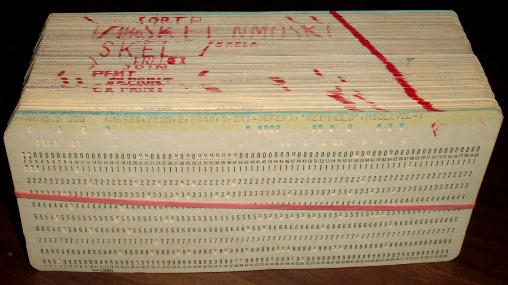
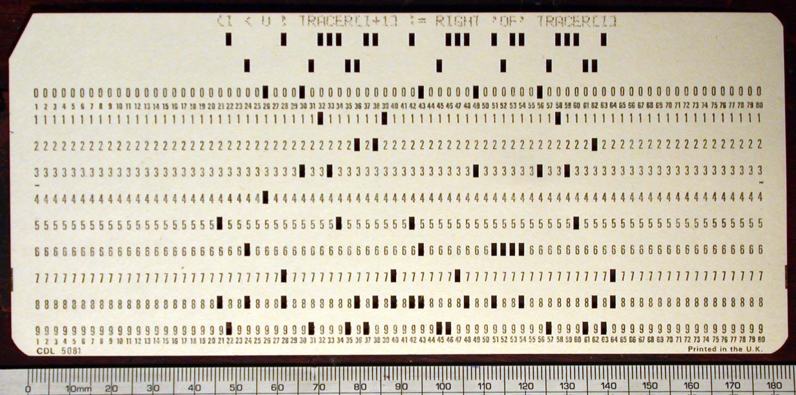

# 4. Input and Output

> Descrição da Imagem: Fotografia exibindo uma operadora posicionada ao lado de uma imensa pilha de cartões perfurados. A estrutura, que atinge quase a altura dos ombros da operadora, é composta por aproximadamente 62.500 cartões de papel cartonado. A imagem ilustra muito bem o volume físico equivalente a 5 milhões de caracteres (cerca de 5 megabytes) de dados, o que correspondia à capacidade total de armazenamento dos primeiros discos magnéticos comerciais da época, como o IBM 305 RAMAC. Atrás da pilha é visível oque parece ser uma Keypunch (máquina de perfurar cartões). A imagem ajuda a visualizar a escala material do volume de dados, inderetamente expondo o extremo esforço logístico e espacial exigido para o manuseio das informações. Todo esse volume precisava ser fisicamente perfurado, rigorosamente ordenado para evitar falhas de sequência, transportado e alimentado em lotes nos leitores eletromecânicos para garantir a continuidade dos cálculos. Isso causava um gargalo que iremos tratar mais pra frente.

## 4.1 I/O Contextualization
- Não havia interfaces modernadas como monitores, teclados e muito menos mouses

## 4.2 Data Input
O processo de inserção de informações no ENIAC era estritamente focado em fornecer os dados numéricos iniciais e as cariáveis necessárias para os cálculos. Como a lógica de programação era configurada diretamente no hardware, através do rearanjo dos cabos e interruptores nas bandejas e painéis da máquina (arquivo 03 e 10 para mais detalhes sobre isso), o sistema de entrada não carregava instruções de software, mas sim operandos brutos que seriam processados pelos acumuladores.

> Nota: Um operando é o valor numérico bruto sobre o qual uma operação matemática é realizada (por exemplo: 5 + 3, tanto o 5 quanto o 3 são operandos). No contexto do ENIAC, é mais preciso chamá-los de operandos em vez de variáveis, pois a máquina não possuía um sistema de endereçamento de memória. Em sistemas que utilizam variáveis, há um endereço simbólico na memória onde um valor é guardado e atualizado. No ENIAC (conforme visto no tópico 3.9), não havia um endereço para o qual o número era salvo; o valor era simplesmente roteado fisicamente pelos cabos diretos para os contadores de anel de um Acumulador.

### 4.2.1 Punched Cards

> Descrição da Imagem: Uma foto de um maço espesso de cartões perfurados unidos por um elástico. Um detalhe visível nesta imagem é a linha diagonal vermelha cruzando o topo da pilha. Essa era uma técnica de segurança visual adotada pelos operadores: ao desenhar uma linha contínua na lateral de um lote ordenado, qualquer cartão que fosse acidentalmente retirado, embaralhado ou inserido fora de ordem faria com que um risco vermelho aparecesse num lado em branco, alertando aos operadores que um dos cartões estavam fora de ordem.

Para introduzir esses dados operacionais, a equipe utilizava o formato padrão da época: os cartões perfurados da IBM (historicamente conhecidos como cartões Hollerith). A informação numérica era representada mecanicamente pela presença ou ausência de furos retangulares em posições específicas da folha de papel cartonado.

> Nota: Papel cartonado é um papel de alta gramatura (gramas por metro quadrado), bastante rígido e espesso (semelhante à um papelão bem fino). A rigidez extra era crucial, pois o papel precisava ser forte o suficiente para não rasgar ou amassar, o que poderia causar problemas de leitura.

Os cartões possuíam dimensões padronizadas de aproximadamente 18,7325cm x 8,255cm x 0,018cm (números quebrados pois o tamanho não era definido em medida de gente, mas sim em polegadas). A área útil do cartão era dividida em uma grade invisível composta por 80 colunas verticais e 12 linhas horizontais. Cada coluna podia representar um único caractere ou dígito. Outro detalhe é que os furos não eram circulares, mas sim pequenos retanguluzinhos, medindo cerca de 0,14 cm x 0,32 cm de altura cada.

Além dos furos e da impressão, todo cartão possuía um corte diagonal em um de seus cantos superiores. Essa característica atuava como uma medida de segurança física à prova de falhas durante o manuseio das grandes pilhas de dados. Se um único cartão estivesse virado de cabeça para baixo ou espelhado no meio do maço, a sua quina reta saltaria visualmente na borda onde todas as outras quinas estavam cortadas em diagonal. Isso permitia que a equipe identificasse e corrigisse rapidamente qualquer desalinhamento antes de inserir a pilha no leitor, evitando que operandos corrompidos fossem enviados para o processamento.

> Descrição da Imagem: Visão frontal um único cartão perfurado padrão IBM (com uma régua na base confirmando evidenciando sua largura de 18,7 cm). É visível também a indexação do cartão: logo abaixo da linha dos zeros (e repetida na borda inferior), há uma fileira de números pequenininhos indo de 1 a 80, indicando a posição de cada uma das 80 colunas. Os furos presentes acima da linha do zero pertencem às chamadas "linhas de zona" (historicamente designadas como linhas 11 e 12, ou X e Y). Enquanto um único furo nas linhas de 0 a 9 representava um dígito, era possível representar letras e símbolos especiais. Para isso, o sistema combinava mais de um furo por coluna (incluindo as furos nas linhas de zona). As diferentes combinações possíveis por coluna é o que permitia à máquina codificar e imprimir caracteres alfabéticos e matemáticos complexos. O texto "( I < U ) TRACERC[I+1] := RIGHT 'OF' TRACERC[I]", legível no topo do cartão, é a tradução dos furos (sim, cada coluna de furos se traduz a um dos caracteres dessa string. Consulte o tópico "4.5 Card Reader" aqui nesse mesmo arquivo para mais detalhes).

### 4.2.2 Keypunch
A confecção desses cartões era realizada por meio de máquinas específicas chamadas Keypunches (perfuradoras de cartões). Operadas através de um teclado semelhante ao de uma máquina de escrever digitavam os números desejados e a perfuradora acionava lâminas internas que cortavam os retângulos nas colunas exatas do cartão, garantindo um alinhamento milimétrico. Simultaneamente ao corte, a Keypunch imprimia com tinta os números correspondentes no topo de cada coluna perfurada, muito útil para facilitar aos operadores a leitura do conteúdo do cartão diretamente, sem a necessidade de decodificar a posição dos furos de cabeça.

### 4.2.3 IBM Card Reader
O dispositivo responsável por extrair as informações físicas do papel era um leitor de cartões da IBM adaptado para o sistema. O funcionamento desse maquinário era eletromecânico e baseava-se em princípios de condutividade elétrica.

Os cartões preenchidos com os dados inicias eram empilhados no alimentador do leitor. Um sistema de roletas puxava um cartão por vez, fazendo-o deslizar em velocidade constante sobre um cilindro metálico eletrificado. Logo acima desse cilindro, repousava uma fileira de escovas metálicas flexíveis, alinhadas com as colunas do cartão.

Como o papel cartonado é um excelente isolante elétrico, as escobas não conduziam corrente enquanto deslizavam sobre a superfície do cartão. Quando um furo passava sob uma dessas escovas, por não haver nada entre a escova e o cilindro metálico, havia um contato momentâneo entre os dois componentes. Esse contato fechava um circuito elétrico, gerando um sinal que correspondia à posição exata do furo, transmitindo o valor numérico que havia sido perfurado.

### 4.2.4 Card Reader Bottleneck
O leitor de cartões operava a uma velocidade constante de aproximadamente 125 cartões por minuto[1]. Embora fosse uma taxa de leitura considerável para os padrões de equipamentos de tabulação mecânica, ela representava um gargalo extremo para a arquitetura do ENIAC.

## 4.3 Constant Transmitter Unit
- A interface entre o leitor de cartões e a arquitetura interna do ENIAC

## 4.4 Data Output
- Como estados eletrônicos internos eram convertidos novamente para cartões perfurados

## 4.5 Printer Unit
- Como cartões perfurados eram traduzidos para números, simbolos e caracteres legíveis

## 4.6 Human Interaction
- O trabalho manual envolvido no carregamento das pilhas de cartões e na operação dos leitores

## 4.7 Modern Comparison
- Como a interface do ENIAC se diferencia da de um computador moderno

| ENIAC I/O | Modern I/O |
