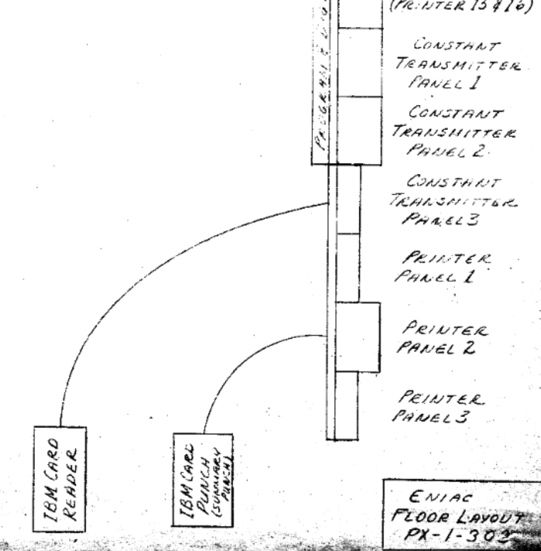
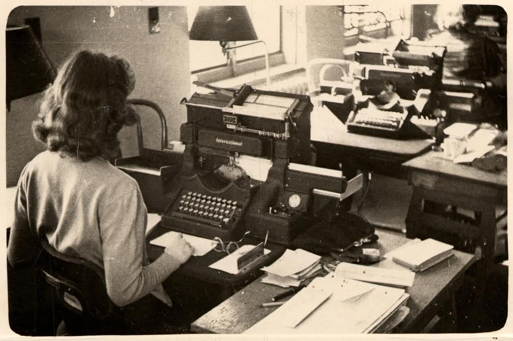
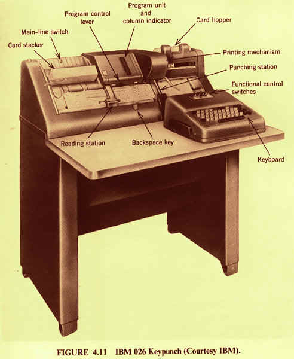
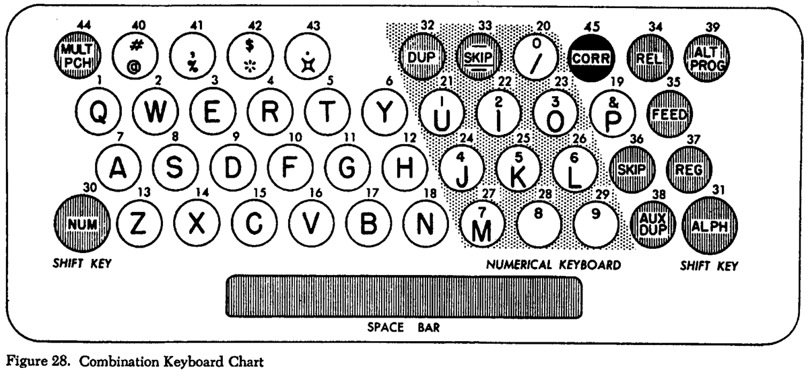
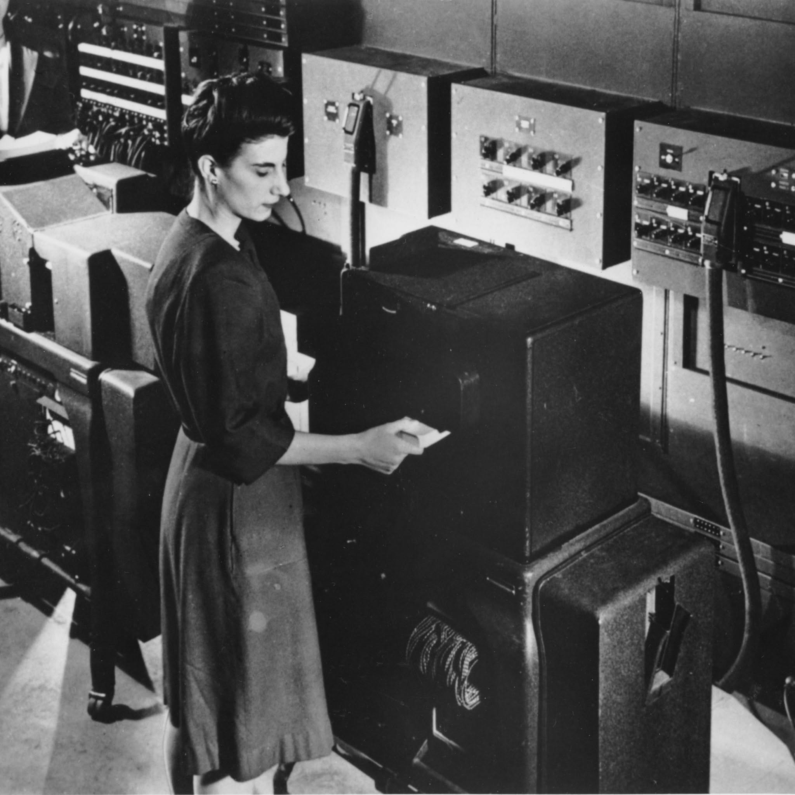
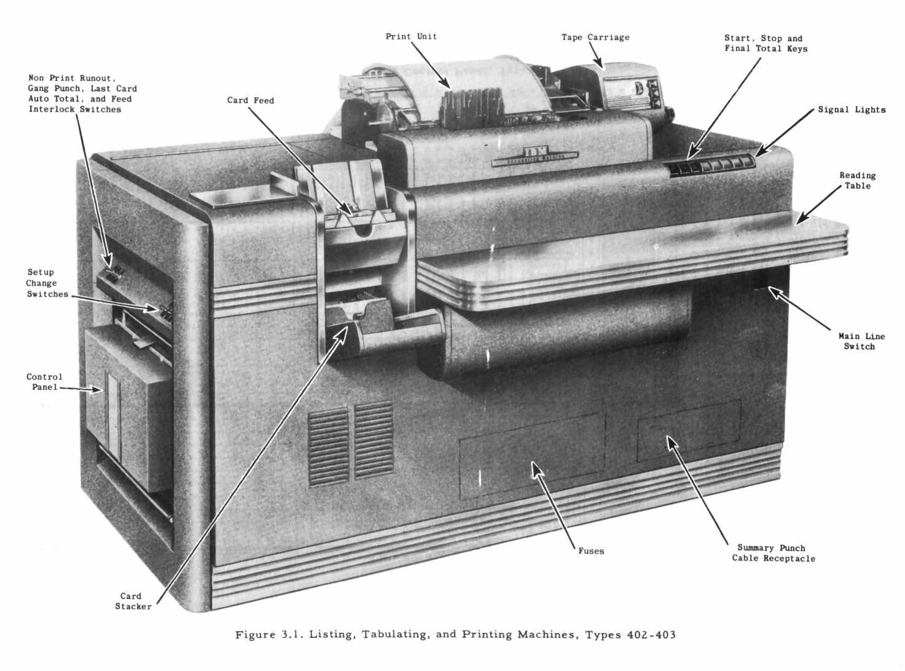
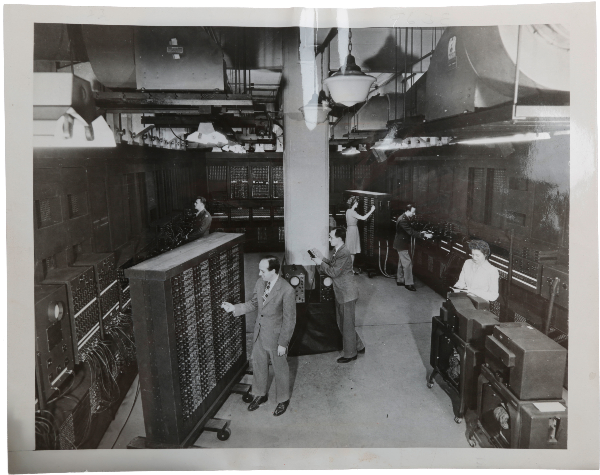
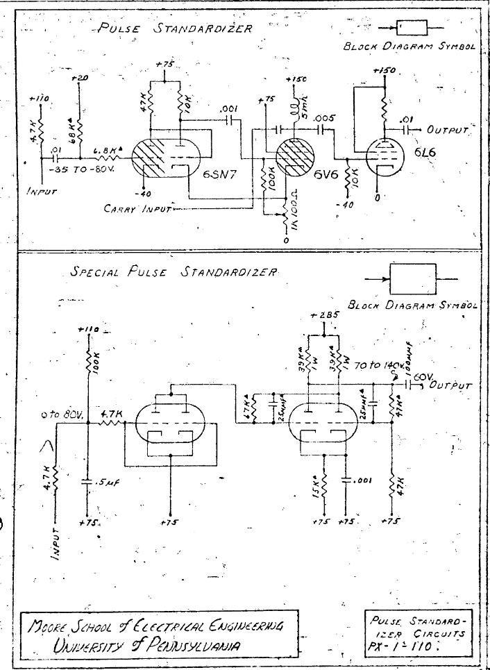
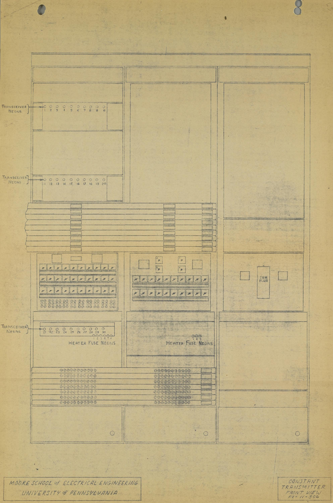

# 4. Input and Output

> Descrição da Imagem: Fotografia exibindo uma operadora posicionada ao lado de uma imensa pilha de cartões perfurados. A estrutura, que atinge quase a altura dos ombros da operadora, é composta por aproximadamente 62.500 cartões de papel cartonado. A imagem ilustra muito bem o volume físico equivalente a 5 milhões de caracteres (cerca de 5 megabytes) de dados, o que correspondia à capacidade total de armazenamento dos primeiros discos magnéticos comerciais da época, como o IBM 305 RAMAC. Atrás da pilha é visível o que parece ser uma Keypunch (máquina de perfurar cartões). A imagem ajuda a visualizar a escala material do volume de dados, indiretamente expondo o extremo esforço logístico e espacial exigido para o manuseio das informações. Todo esse volume precisava ser fisicamente perfurado, rigorosamente ordenado para evitar falhas de sequência, transportado e alimentado em lotes nos leitores eletromecânicos para garantir a continuidade dos cálculos. Isso causava um gargalo que iremos tratar mais pra frente.

## 4.1 I/O Contextualization
- Não havia interfaces modernadas como monitores, teclados e muito menos mouses

## 4.2 Data Input
O processo de inserção de informações no ENIAC era estritamente focado em fornecer os dados numéricos iniciais e as variáveis necessárias para os cálculos. Como a lógica de programação era configurada diretamente no hardware, através do rearranjo dos cabos e interruptores nas bandejas e painéis da máquina (arquivo 03 e 10 para mais detalhes sobre isso), o sistema de entrada não carregava instruções de software, mas sim operandos brutos que seriam processados pelos acumuladores.

> Nota: Um operando é o valor numérico bruto sobre o qual uma operação matemática é realizada (por exemplo: 5 + 3, tanto o 5 quanto o 3 são operandos). No contexto do ENIAC, é mais preciso chamá-los de operandos em vez de variáveis, pois a máquina não possuía um sistema de endereçamento de memória. Em sistemas que utilizam variáveis, há um endereço simbólico na memória onde um valor é guardado e atualizado. No ENIAC (conforme visto no tópico 3.9), não havia um endereço para o qual o número era salvo; o valor era simplesmente roteado fisicamente pelos cabos diretos para os contadores de anel de um Acumulador.

### 4.2.1 Punched Cards

> Descrição da Imagem: Uma foto de um maço espesso de cartões perfurados unidos por um elástico. Um detalhe visível nesta imagem é a linha diagonal vermelha cruzando o topo da pilha. Essa era uma técnica de segurança visual adotada pelos operadores: ao desenhar uma linha contínua na lateral de um lote ordenado, qualquer cartão que fosse acidentalmente retirado, embaralhado ou inserido fora de ordem faria com que um risco vermelho aparecesse num lado em branco, alertando aos operadores que um dos cartões estavam fora de ordem.

Para introduzir esses dados operacionais, a equipe utilizava o formato padrão da época: os cartões perfurados da IBM (historicamente conhecidos como cartões Hollerith). A informação numérica era representada mecanicamente pela presença ou ausência de furos retangulares em posições específicas da folha de papel cartonado.

> Nota: Papel cartonado é um papel de alta gramatura (gramas por metro quadrado), bastante rígido e espesso (semelhante à um papelão bem fino). A rigidez extra era crucial, pois o papel precisava ser forte o suficiente para não rasgar ou amassar, o que poderia causar problemas de leitura.

Os cartões possuíam dimensões padronizadas de aproximadamente 18,7325cm x 8,255cm x 0,018cm (números quebrados pois o tamanho não era definido em medida de gente, mas sim em polegadas). A área útil do cartão era dividida em uma grade invisível composta por 80 colunas verticais e 12 linhas horizontais. Cada coluna podia representar um único caractere ou dígito. Outro detalhe é que os furos não eram circulares, mas sim pequenos retangulozinhos, medindo cerca de 0,14 cm x 0,32 cm de altura cada.

Além dos furos e da impressão, todo cartão possuía um corte diagonal em um de seus cantos superiores. Essa característica atuava como uma medida de segurança física à prova de falhas durante o manuseio das grandes pilhas de dados. Se um único cartão estivesse virado de cabeça para baixo ou espelhado no meio do maço, a sua quina reta saltaria visualmente na borda onde todas as outras quinas estavam cortadas em diagonal. Isso permitia que a equipe identificasse e corrigisse rapidamente qualquer desalinhamento antes de inserir a pilha no leitor, evitando que operandos corrompidos fossem enviados para o processamento.

> Descrição da Imagem: Visão frontal um único cartão perfurado padrão IBM (com uma régua na base confirmando evidenciando sua largura de 18,7 cm). É visível também a indexação do cartão: logo abaixo da linha dos zeros (e repetida na borda inferior), há uma fileira de números pequenininhos indo de 1 a 80, indicando a posição de cada uma das 80 colunas. Os furos presentes acima da linha do zero pertencem às chamadas "linhas de zona" (historicamente designadas como linhas 11 e 12, ou X e Y). Enquanto um único furo nas linhas de 0 a 9 representava um dígito, era possível representar letras e símbolos especiais. Para isso, o sistema combinava mais de um furo por coluna (incluindo as furos nas linhas de zona). As diferentes combinações possíveis por coluna é o que permitia à máquina codificar e imprimir caracteres alfabéticos e matemáticos complexos. O texto "( I < U ) TRACERC[I+1] := RIGHT 'OF' TRACERC[I]", legível no topo do cartão, é a tradução dos furos (sim, cada coluna de furos se traduz a um dos caracteres dessa string. Consulte o tópico "4.5 Card Reader" aqui nesse mesmo arquivo para mais detalhes).

> Nota: Para indicar que um número era negativo, a operadora fazia um furo extra na linha de zona 11 (historicamente conhecido como furo X) em uma coluna específica designada para abrigar o sinal daquele operando. Quando o cartão passava pelo leitor, a escova detectava esse furo na zona superior e enviava um pulso elétrico que ativava um relé dedicado exclusivamente ao sinal de menos no Constant Transmitter. Se não houvesse furo nessa posição, o circuito assumia o comportamento padrão e o número era tratado como positivo.

### 4.2.2 Keypunches
A confecção desses cartões era realizada por meio de máquinas eletromecânicas chamadas Keypunches (perfuradoras de cartões).Durante o período de operação do ENIAC (1945–1955), a equipe (provavelmente) utilizou os modelos padronizados da IBM da época, com destaque para as perfuradoras alfabéticas de impressão (a exemplo da IBM Type 032 e, posteriormente, da IBM 026).

> Nota: Esse subtópico não entra em tanto detalhe sobre o funcionamento das keypunches porque: 1. Não encontrei boa documentação sobre qual modelo exatamente era usado para perfurar os cartões que o ENIAC usava (estou chutando que era o standard da época), e 2. As keypunches não faziam parte do ENIAC, era mais um periférico necessário (como se fosse o teclado do ENIAC) para dar input, mas qual máquina exatamente fez os cartões não importava tanto, contatno que os cartões estivessem legíveis para o Card Reader.

> Descrição da Imagem: Fotografia de uma operadora trabalhando em uma perfuradora de cartões IBM Type 032. Logo acima do teclado, quase não legível, vemos o texto "International" (de International Business Machines, a IBM).

Uma Keypunch assemelhava-se a uma pequena escrivaninha metálica pesada, equipada com um teclado integrado. O maquinário interno combinava motores elétricos, sistemas de alimentação mecânica por roletes, relés eletromecânicos e matrizes de corte de aço. A máquina possuía 5 mecanismos principais:

1. Alimentador: Uma pilha de cartões em branco era inserida em um compartimento inclinado no canto superior direito da máquina.

2. Estação de Perfuração: Ao iniciar o processo, a máquina puxava um único cartão do Alimentador e o posicionava na estação de corte. Conforme a operadora digitava, o cartão avançava mecanicamente, coluna por coluna. Cada tecla pressionada fechava contatos elétricos que acionavam solenoides, disparando lâminas de aço afiadas para baixo e recortando os retângulos de forma precisa no papel cartonado.

3. Mecanismo de Impressão: Simultaneamente à perfuração da lâmina, os modelos de impressão possuíam matrizes de tipos (semelhantes às hastes de uma máquina de escrever) que carimbavam com tinta o caractere correspondente no topo da coluna recém perfurada. Isso permitia a leitura rápida do cartão sem a necessidade de decodificar visualmente a posição dos furos.

4. Estação de Leitura: Após passar pela perfuração, o cartão avançava para uma segunda estação. Essa etapa possuía uma função de duplicação. Se um lote de cartões precisasse compartilhar os mesmos dados nas primeiras 20 colunas (como uma data ou o número de identificação de um teste balístico), a máquina lia os furos do cartão anterior (que já estava na estação de leitura) e acionava automaticamente as lâminas para perfurar o cartão atual (na estação de perfuração), poupando a operadora de redigitar informações repetitivas. (Uma das primeiras formas do ctrl + c, ctrl + v)

5. Empilhador: Ao finalizar as 80 colunas, o cartão era ejetado e empilhado ordenadamente no canto superior esquerdo da máquina, pronto para ser agrupado na pilha final.

> Descrição da Imagem: Ilustração de uma perfuradora IBM 026. A imagem mapeia as estações de trabalho descritas acima, evidenciando o caminho que o cartão percorre da direita para a esquerda. O Card hopper (Alimentador), no canto superior direito, é por onde os cartões em branco entravam, descendo para a Punching station (Estação de Perfuração) e o Printing mechanism (Mecanismo de Impressão). Mais à esquerda, localiza-se a Reading station (Estação de Leitura), usada para a duplicação mecânica de dados, e finalmente no Card stacker (Empilhador) no canto superior esquerdo.

Como a maioria dos dados inseridos para os cálculos do ENIAC eram dados numéricos, o teclado possuía um agrupamento denso de teclas de números concentrado sob a mão direita da operadora. Esse design otimizava a velocidade de digitação de longas sequências de operandos com apenas uma das mãos, enquanto a outra podia manusear os documentos de origem.

A precisão era um fator crítico, pois não era possível dar ctrl + z num furo já feito no papel. Se a operadora percebesse que havia digitado um número errado na coluna 45, o cartão inteiro estava arruinado. A única forma de correção era ejetar o cartão com o erro, descartá-lo, alimentar um novo cartão em branco e usar a função de duplicação da Reading Station para copiar mecanicamente as primeiras 44 colunas corretas do cartão estragado, assumindo então o controle manual para digitar o restante dos dados corretamente (tecnicamente um ctrl + z, mas um cartão inteiro precisava ser descartado no processo).

> Descrição da Imagem: Esquema do teclado combinado (Combination Keyboard) de uma perfuradora IBM 026. O diagrama destaca a zona hachurada à direita, que mostra como o teclado numérico (dígitos de 0 a 9) era densamente agrupado e sobreposto às teclas de letras (U, I, O, J, K, L, M). Isso permitia que a operadora digitasse longas sequências de operandos em alta velocidade usando apenas a mão direita (tomando cuidado com shift). Há também outras teclas de controle, como "DUP" (para acionar a função de duplicar as colunas de um cartão para o outro) e as teclas "NUM" e "ALPH" nas extremidades inferiores (funcionando como a tecla shift para alternar a configuração das lâminas entre a perfuração de números ou de letras).

> Nota: Era possível digitar com apenas uma mão sim, mas era preciso tomar bastante cuidado com o shift, para não escrever uma letra invés de um número sem querer.

Cada furo retangular gerava um pedacinho de papel, conhecido como chad. Devido ao grande volume de cartões processados diariamente para alimentar os cálculos balísticos, as máquinas possuíam uma caixa de coleta embutida sob a mesa, a chad box. O esvaziamento periódico dessas caixas era uma rotina obrigatória da sala de operações.

> Nota: O nome "chad box" é hilário observando retrospectivamente KKKKKKK

#### 4.2.2.1 Extra
Encontrei um vídeo mostrando uma "IBM 026 Key Punch" funcionando! O vídeo mostra muito bem a operação de um Keypunch em menos de 3 minutos, recomendo assisti-lo se você quiser visualizar melhor como o processo dessa máquina funcionava: https://youtu.be/Y0GurDnBK8E

### 4.2.3 IBM Card Reader

> Descrição da Imagem: Fotografia de uma operadora do ENIAC alimentando uma pilha de cartões perfurados no Leitor de Cartões da IBM. É possível ver a parede direita do ENIAC, bem perto de onde se encontra a Unidade de Transmissão de Constantes, que recebe a leitura dos cartões feita pelo Card Reader.

O dispositivo responsável por extrair as informações do papel era um leitor de cartões da IBM adaptado para o sistema. Os cartões preenchidos com os dados inicias eram empilhados no alimentador do leitor. Um sistema de roletas puxava um cartão por vez, fazendo-o deslizar em velocidade constante sobre um cilindro metálico eletrificado, lendo aproximadamente 125 cartões por minuto. Logo acima desse cilindro, repousava uma fileira de escovas metálicas flexíveis, alinhadas com as colunas do cartão.

Diferente da Keypunch, que processava o cartão avançando coluna por coluna, o Leitor de Cartões fazia o contrário. O cartão entrava na máquina com sua borda mais longa virada para frente, começando pelas linha dos noves e lendo linha por linha até as linhas de zona. Isso significa que o entendimento dos dados em um cartão só era possível após ele ser lido por completo, pois par ter certeza de qual caractere uma coluna representava, era necessário ler todas as linhas anteriormente.

> Nota: Nas máquinas originais da IBM, as engrenagens precisavam de tempo mecânico para girar. Se a máquina lesse um "9", a engrenagem engatava cedo e girava 9 dentes até o final do ciclo. Se lesse "1", engatava tarde e girava apenas 1 dente. Por isso, os números maiores precisavam ser lidos primeiro.

#### 4.2.3.1 Reading
O leitor possuía uma fileira com 80 escovas metálicas flexíveis posicionadas lado a lado, uma para cada coluna. O cartão deslizava em velocidade constante sobre um cilindro metálico eletrificado, e como o papel cartonado é um excelente isolante elétrico, as escovas não conduziam corrente enquanto deslizavam sobre a superfície do cartão. Quando um furo passava sob uma dessas escovas, por não haver nada entre a escova e o cilindro metálico, havia um contato momentâneo entre os dois componentes. Esse contato fechava um circuito elétrico, gerando um sinal que correspondia à posição exata do furo, transmitindo o valor numérico que havia sido perfurado.

> Nota: Uma dúvida que me surgiu foi "o que acontecia no espaço vazio entre um cartão e o próximo? Se não houvesse papel isolando o cilindro, as 80 escovas tocariam o metal simultaneamente, enviando uma leitura falsa de que o cartão estava inteiramente furado". A resposta é que para não acontecer, o leitor possuía um came mecânico (um interruptor rotativo sincronizado com as engrenagens da máquina). Esse interruptor cortava a energia do cilindro metálico no exato momento em que a borda final de um cartão passava pelas escovas, e só reenergizava o cilindro quando a borda do cartão seguinte já estivesse posicionada sob as escovas para a leitura. Isso garantia que a máquina só ficava de olhos abertos aos sinais elétricos durante a janela de tempo em que o cartão estava sendo processado.

> Descrição da Imagem: Diagrama técnico de uma Máquina de Contabilidade IBM da série 400, o exato tipo de maquinário base que foi pesado e customizado para atuar como o Leitor de Cartões do ENIAC. Como a IBM não construiu um leitor do zero para o projeto, a equipe adaptou essa máquina comercial. No diagrama podemos ver os seguintes componentes:

- Card Feed (Alimentador) e Card Stacker (Empilhador): Respectivamente, o local onde a pilha de cartões não lidos era inserida (alimentando o maquinário) e o compartimento inferior onde os cartões eram depositados de forma ordenada após passarem pelo cilindro de leitura.

- Reading Table (Mesa de Leitura): Uma superfície plana estendida na frente da máquina, desenhada ergonomicamente para que a operadora pudesse apoiar, inspecionar e organizar grandes maços de cartões antes de inseri-los no alimentador.

- Control Panel (Painel de Controle): Localizado na lateral esquerda, era um plugboard (painel de conexões por cabos). Na máquina original, ele roteava os sinais das escovas de leitura para os contadores mecânicos internos. No ENIAC, esse painel foi customizado para rotear os sinais elétricos para fora da máquina.

- Summary Punch Cable Receptacle (Receptáculo do Cabo): Na base direita, era a porta de conexão de dados pesada. Originalmente usada para conectar a máquina a um perfurador externo, no ecossistema do ENIAC, era através dessa interface que os grossos cabos umbilicais levavam os pulsos elétricos do leitor diretamente para a Constant Transmitter Unit.

- Print Unit (Unidade de Impressão) e Tape Carriage (Carro de Fita): Localizados no topo, eram os mecanismos originais da máquina usados para imprimir relatórios em papel contínuo. Embora presentes na carcaça base, essas funções de impressão não eram o objetivo do ENIAC ao usar a máquina como um mero leitor de entrada.

- Start, Stop and Final Total Keys (Teclas de Início, Parada e Total Final): O painel de botões principal operado pelo usuário para iniciar a alimentação dos cartões ou interromper o processo mecanicamente.

- Signal Lights (Luzes de Sinalização) e Fuses (Fusíveis): Lâmpadas indicadoras de status (como máquina pronta ou erro de leitura) e os painéis de acesso aos fusíveis para proteção contra curtos-circuitos elétricos.

- Main Line Switch (Interruptor Principal): A chave geral de energia que ligava os motores e energizava o cilindro metálico de leitura.

- Setup Change Switches (Chaves de Mudança de Configuração): Interruptores laterais que permitiam alterar o comportamento mecânico da máquina sem precisar refazer a fiação do Control Panel.

- Non Print Runout, Gang Punch, Last Card Auto Total, and Feed Interlock Switches: Um conjunto de chaves de controle de fluxo de papel. O Runout, por exemplo, era usado para ejetar cartões presos no maquinário em caso de atolamento, enquanto o Feed Interlock era um mecanismo de segurança que parava os motores se o alimentador ficasse vazio ou se a tampa estivesse aberta.

> Nota: Um detalhe sobre o Leitor de Cartões era a flexibilidade proporcionada pelo seu Control Panel (o plugboard na lateral da máquina). Ele funcionava como uma central de roteamento customizável. Se um lote de cartões tivesse um operando perfurado nas colunas 40 a 50, mas para um novo cálculo o ENIAC precisasse receber esses dados em uma porta de entrada diferente do Constant Transmitter, a equipe não precisava jogar os cartões fora e perfurar tudo de novo. Bastava rearranjar os cabos no painel do próprio leitor, conectando a saída física da escova 40 para a nova rota desejada. Era uma forma engenhosa de formatar, redirecionar e reaproveitar os dados diretamente na interface de leitura, economizando um tempo logístico bem grande.

#### 4.2.3.2 Synchronization
O leitor de cartões era uma máquina puramente mecânica e operava em seu próprio ritmo de engrenagens, sendo infinitamente mais lento e completamente dessincronizado do relógio eletrônico de 100 kHz da Unidade Ciclo do ENIAC. Para garantir que uma leitura no tempo X estivesse correta para o computador, o leitor não enviava os dados diretamente para os acumuladores. Em vez disso, os sinais elétricos gerados pelas escovas eram enviados para a Constant Transmitter Unit (detalhes no tópico 4.3). Essa unidade funcionava como uma sala de espera (um buffer eletromecânico feito de relés), que segurava os números lidos pelo cartão até que o ENIAC estivesse pronto para processa-los.

> Nota: O leitor de cartões operava a uma velocidade constante de aproximadamente 125 cartões por minuto. Embora fosse uma taxa de leitura considerável para os padrões de equipamentos de tabulação mecânica, ela representava um gargalo muito grande relativa ao resto da arquitetura do ENIAC. Enquanto as engrenagens e roletes levavam quase meio segundo para puxar e ler um único pedaço de papel, a máquina era capaz de realizar milhares de operações matemáticas simultâneas em seus acumuladores. Devido a essa disparidade entre a input e o processamento do mesmo, a configuração dos cálculos precisava ser meticulosamente planejada para exigir o mínimo de leituras de cartões possível durante a execução (mais detalhes sobre isso no tópico 9.5 no arquivo 09-performance).

#### 4.2.3.3 Reuse and Reorganization
Após passar pelo cilindro de leitura, roletes ejetavam o cartão para um compartimento de saída chamado Stacker (Empilhador), mantendo a ordem exata em que os cartões entraram. Os cartões eram altamente reutilizáveis, servindo essencialmente como uma memória Read Only da época. Se um problema balístico precisasse ser recalculado, a mesma pilha de cartões era usada. Se uma pilha caísse no chão ou precisasse ser reordenada para um cálculo diferente, a equipe utilizava uma máquina periférica separada chamada Card Sorter (Classificadora de Cartões, também da IBM). A operadora configurava a classificadora para ler uma coluna específica, e a máquina jogava fisicamente os cartões em 13 caixas diferentes (uma para cada número de 0 a 9, mais as zonas extras), reordenando a pilha de forma automatizada.

> Nota: A ordem de entrada dos cartões era definida 100% pela equipe operadora. Se um cartão fosse inserido de cabeça para baixo, a escova da coluna 1 leria os dados da coluna 80, e a linha dos 9s seria lida como a a primeira linha de zona. O leitor fecharia os circuitos normalmente e enviaria um pacote de dados incorretos para o ENIAC (basicamente corrompia o pacote de dados). Como a máquina não tinha nenhum mecanismo para identificar a orientação do texto impresso, a única linha de defesa contra esse tipo de problema era o corte diagonal no canto do cartão (mencionado no tópico 4.2.1), que dependia completamente da inspeção da operadora antes de colocar os cartões no alimentador.

## 4.3 Constant Transmitter Unit

O Constant Transmitter (Transmissor de Constantes) era uma unidade híbrida composta por três painéis modulares localizada na parede direita perto do canto inferior da sala do ENIAC. Sua arquitetura combinava a lentidão mecânica dos relés com a velocidade eletrônica das válvulas de vácuo. A unidade atuava como uma memória estática temporária para os sinais elétricos vindos do Leitor de Cartões da IBM e fornecia uma interface de hardware para a inserção de constantes matemáticas.

> Descrição da Imagem: Fotografia panorâmica da sala de operações do ENIAC, com destaque para o canto inferior direito (extremamente ignorado pelos fotografos da época, eles provavelmente não achavam interessante o suficiente eu acho kkkk). Nesta área de Entrada e Saída, vemos uma operadora inspecionando documentos ao lado do maquinário periférico da IBM. Um detalhe quase fora do enquadro desta imagem é o cabo umbilical que certamente está ligado ao Leitor de Cartões (suponho, mas não é visível na imagem) e se conecta ao painel 3 da Unidade de Transmissão de Constantes.

> Nota: Por algum motivo é extremamente difícil encontrar fotos da área de Input/Output. Acredito que possívelmente o pessoal não considerava os mecanismos envolvidos tão interessantes assim, ou sei lá kkkkk. Essa foi a foto que encontrei mais próxima de mostrar essa parte do ENIAC.

Para entender como a unidade convertia um furo no papel dados elétricos empacotados em ciclos de 100 kHz, é necessário analisar seu circuito em três estágios:

### 4.3.1 Relay Buffer
A comunicação entre o Leitor de Cartões e o Painel 3 do Constant Transmitter ocorria através de um cabo umbilical contendo dezenas de condutores paralelos (detalhes sobre cabos umbilicais no tópico 3.7.4). Quando o cilindro eletrificado do leitor entrava em contato com uma escova através de um furo no cartão, um pulso elétrico de (relativa) longa duração era enviado por uma dessas vias.

> Nota: Buffer é uma área de espera onde dados permanecem armazenados temporariamente.

Dentro do Painel 3, esse sinal elétrico parava em um grande banco de relés eletromecânicos. O pulso energizava a bobina de um relé específico, criando um campo magnético que puxava uma armadura de metal, fechando um contato físico. Esse relé era projetado para travar mecanicamente, mantendo o circuito fechado mesmo após o cartão ter sido ejetado do leitor.

Nesse momento, a informação do cartão (80 dígitos e até 16 sinais algébricos) deixava de ser um movimento mecânico e passava a existir como uma matriz de tensões contínuas dentro do ENIAC. Se o relé estivesse fechado, ele aplicava uma tensão de polarização positiva (ou, nesse caso, menos negativa do que o estado de repouso) nas grades de controle de um conjunto específico de válvulas pentodo mais adiante no circuito. Se estivesse aberto, a grade permanecia em estado de corte (tensão em repouso).

### 4.3.2 Pulse Generation
Para criar pulsos, o Constant Transmitter dependia inteiramente da conexão com Unidade Cíclica. A unidade recebia continuamente os trens de pulso fundamentais: 1P, 2P, 2'P, 4P, 1'P, 9P e 10P. (Recomendo ler os 4 primeiros subtópicos do tópico 3.2 antes de ler esse subtópico aqui)

A conversão do estado estático do relé para pulsos dinâmicos ocorria através de portas lógicas AND analógicas, baseadas no princípio de coincidência das válvulas pentodo (conforme detalhado no tópico 3.2.3). O circuito funcionava da seguinte maneira:

A unidade permanecia passiva até que um pulso de programa/controle chegasse por um cabo coaxial em uma de suas 30 portas de programa. Esse pulso acionava um circuito Flip-Flop interno, elevando a tensão de uma das grades do pentodo transmissor (abrindo a Gate para aquele ciclo de adição). Com a Gate aberta, as válvulas liam as tensões DC vindas dos relés. O circuito interno roteava as linhas da Unidade Cíclica com base no relé ativado. Se o relé correspondente ao dígito 7 estivesse ativado, a fiação interna do chassi conectava as grades da válvula transmissora às linhas 1P, 2P e 4P da Unidade Cíclica.

Durante a primeira metade do ciclo de 200 microssegundos (tempos 1/20 a 10/20), os pulsos de 100 kHz vindos da Unidade Cíclica batiam na válvula. Como a grade já estava polarizada positivamente pelo relé e a Gate estava aberta pelo Flip-Flop, a válvula entrava em saturação e permitia a passagem exata de 1 pulso no tempo 1, 2 pulsos nos tempos 2 e 3, e 4 pulsos nos tempos 6 a 9. O dígito 7 havia sido sintetizado (sem sobreposição de tempos dentro do ciclo).

No tempo 19/20 do ciclo, a Unidade Cíclica disparava o Reset Pulse de +50V. Esse pulso atingia o Flip-Flop de programa do Constant Transmitter, revertendo-o ao estado de repouso, fechando a Gate e encerrando a transmissão antes do tempo 0 do próximo ciclo. Simultaneamente, a unidade emitia um Program Pulse por um cabo coaxial de saída, avisando à próxima unidade que a leitura havia sido concluída.

### 4.3.3 Output Routing
Os pulsos sintetizados precisavam viajar do Constant Transmitter até os Acumuladores ou Multiplicadores. Antes de saírem do painel, os sinais passavam por Pulse Standardizers (tubos 6SN7) para garantir que as bordas de onda estivessem perfeitamente retangulares, seguidos por Pulse Amplifiers (tubos 6V6 e 6L6) que injetavam a corrente necessária para a viagem.

> Descrição da Imagem: Esquema elétrico do circuito padronizador de pulso. O estágio inicial utiliza a válvula de duplo tríodo 6SN7 configurada como um gatilho monoestável para regenerar as bordas retangulares da onda deformada, enquanto os estágios seguintes com as válvulas de potência 6V6 e 6L6 restauram a amplitude de tensão e fornecem corrente suficiente para o sinal percorrer as longas linhas da máquina.

Os dados saíam da unidade através dos conectores de Bakelite da Amphenol, viajando pelos Digit Trunks (cabos de 11 vias) alocados nas Digit Trays (Bandejas de Dígitos) frontais. A unidade possuía 5 soquetes de saída de dados, o que permitia transmitir até 5 operandos completos de 10 dígitos (mais o sinal) simultaneamente em um único ciclo de 200 microssegundos, desde que os cabos estivessem fisicamente roteados para os acumuladores corretos.

### 4.3.4. Rotary Switches
Para evitar o desperdício de tempo mecânico lendo cartões com variáveis que nunca mudavam (como o valor de Pi ou coeficientes de arrasto aerodinâmico), os Painéis 1 e 2 do Constant Transmitter operavam de forma independente do Leitor de Cartões. Esses painéis eram equipados com matrizes de chaves rotativas manuais. Cada chave possuía contatos físicos numerados de 0 a 9. Ao girar o botão para o número 3, o operador fechava mecanicamente um circuito idêntico ao que o relé fecharia no Painel 3.

Essas chaves substituíam o buffer de relés na matriz de síntese. Quando um Program Pulse ativava a rotina de uma constante manual, as válvulas pentodo liam a tensão DC diretamente das chaves rotativas, aplicando a mesma lógica de coincidência com os sinais da Unidade Cíclica para gerar os Digit Pulses. O hardware permitia configurar até 20 dígitos numéricos e 4 sinais diretamente nas chaves, disponibilizando operandos fixos que podiam ser lidos em velocidades eletrônicas inúmeras vezes durante a execução do programa, sem qualquer gargalo mecânico.

> Descrição da Imagem: Desenho técnico oficial da visão frontal da Unidade de Transmissão de Constantes. O diagrama ilustra claramente a divisão da unidade em três grandes painéis verticais modulares:
>
> Painéis 1 e 2 (Esquerda e Centro): Destinados à inserção manual de dados. Na parte central de ambos os painéis, é possível ver as densas matrizes de chaves rotativas manuais organizadas em fileiras. São essas chaves que os operadores giravam para configurar os dígitos de 0 a 9 e os sinais, permitindo que a máquina lesse constantes matemáticas sem depender dos cartões.
>
> Ladeando essas chaves no painel da esquerda, há blocos de luzes indicadoras etiquetados como "TRANSCEIVER NEONS", numerados de 1 a 30, que serviam para feedback visual do estado dos circuitos, e "HEATER FUSE NEONS", que indicavam o status dos fusíveis de aquecimento das válvulas. (Detalhes mais ligados ao output)
>
> Painel 3 (Direita): Destinado à comunicação com o maquinário da IBM. Diferente dos outros dois, este painel não possui chaves rotativas. Em vez disso, seu grande destaque é um receptáculo retangular central claramente etiquetado como "IBM PLUG". É exatamente nesta porta que o grosso cabo umbilical de dezenas de vias (mencionado no tópico 4.3.1) era conectado, trazendo os pulsos elétricos estáticos gerados pelo Leitor de Cartões para dentro do banco de relés da unidade.
>
> Bandejas e Conexões: Atravessando horizontalmente a parte inferior dos painéis 1 e 2, vemos a representação das Digit Trays. Abaixo delas, há várias fileiras de pequenos círculos, que representam os soquetes (receptáculos) por onde os Program Pulses e Digit Pulses entravam e saíam da unidade através de cabos coaxiais e conectores de dados, roteando as informações para os Acumuladores.

## 4.4 Data Output
- Como estados eletrônicos internos eram convertidos novamente para cartões perfurados

A forma utilizada pelo ENIAC para manter e converter dados era um tanto quanto única, pois, haviam algumas etapas cadênciadas que o sistema seguia para que os resultados fossem repassados corretamente. O ponto inicial era entender onde se encontravam os valores "armazenados". Os acumuladores guardavam números em contadores de anel de flip-flops, um por casa decimal somados a um contador PM para o sinal. Cada estágio de um contador é um flip-flop, e cada acumulador tinha "saídas estáticas" ligadas direto aos estágios dos contadores. Dessa forma, o dado direto do digíto não precisava ser "lido" por pulsos, pois o estado elétrico dos flip-flops já estava disponível continuamente na corrente de sinais do sistema. 
Após isso, as saídas precisavam ser levadas à impressora alocada ao ENIAC. As saídas estáticas de 80 contadores de dígito e 16 contadores PM eram ligadas à unidade printer, que era a responsável por transformar de forma direta os dados em perfurações nos cartões. 

>Por foto demonstrando (place holder)
>Ao que tudo indica esses números correspondem à capacidade de um cartão de 80 colunas.

Por mais que os valores estivessem já corretamente calculados e fossem formados nos acumuladores ligados à impressora, ou enviados a eles, antes do momento da impressão, e os dados fossem quase onipresentes no sistemas por serem armazenados em uma corrente elétrica que se mantinha constate no ENIAC. A unidade printer só "recebia" o conhecimento dos pulsos os punha em cartão quando recebia uma instrução de programa exata dada por um operador. 

Já quanto a saída direta e transformação fisíca dos dados em perfurações, estas aparentemente eram circuitos numéricos da printer, sendo formados pelos tubos que são ajustados pelas saídas estáticas dos contadores cujo conteúdo será perfurado. Ou seja, o estado dos contadores era copiado para tubos próprios da printer. Esses tubos então comandavam o punch da IBM. (Uma perfuradora comercial utilizada desde os anos 1928. No entanto não há resgistros exatos do modelo utilizado). O punch como parte eletromecânica funcioava a partir do comando passado pela printer , que era a principal controladora da IBM. Perfurar levava cerca de 0,6 s, contra 0,5 s para ler um cartão, mas o dispositivo emitia um pulso de programa ao terminar, integrando-se ao sistema síncrono, assim não havia risco de desregular o clock do sistema, bem como consistia de um dado de finalização concreto.

Por fim, os cartões já perfurados, (que por formato padrão da ibm eram constituidos de 12 linhas por 80 colunas, contudo esses podiam ter sido modificados para o Eniac) eram utilizados primáriamente de duas formas. Como resultado final, onde as tabelas eram impressas automaticamente a partir dos cartões por um tabulador IBM não específicado. Ou como armazenamento intermediário, sendo que, caso faltasse espaço nos acumuladores, os números podiam ser perfurados pela printer e reintroduzidos depois pelo reader e pelo constant transmitter. 

## 4.5 Printer Unit
- Como cartões perfurados eram traduzidos para números, simbolos e caracteres legíveis 
(coloque uma tabelinha de tradução de colunas de cartões aqui)

## 4.6 Human Interaction
- O trabalho manual envolvido no carregamento das pilhas de cartões e na operação dos leitores

## 4.7 Modern Comparison
- Como a interface do ENIAC se diferencia da de um computador moderno

| ENIAC I/O | Modern I/O |
